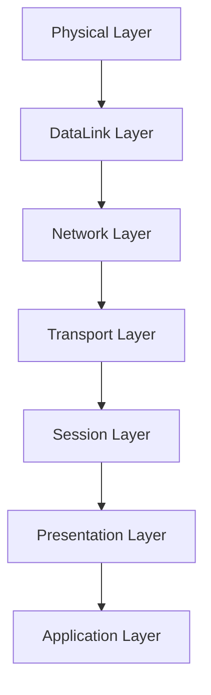

> 네트워크 통신을 7단계로 나뉘어 표현

# 1. OSI 7계층란?
네트워크 송수신간 어느 지점에서 문제가 발생했는지 보다 명확하게 식별 할 수 있게, 송수신 내 단계별로 캡슐화 하여 보다 파악이 용이하도록 `국제 표준화 기구 (ISO)` 에서 표준을 지정하였다.

# 2. OSI 7계층 단계

## 2-1. Physical Layer : 물리 계층
실제 데이터 송수신이 발생하는 물리적 계층
전기적, 기계적인 특성을 기반으로 통신케이블을 통해 데이터를 전달한다.
- 이 계층에서는 해당 데이터를 그저 전달만 할 뿐, 정합성이나 별도의 validation check를 수행하지 않는다.
- 주로 케이블, 리피터, 허브를 통해 데이터를 전송한다.

## 2-2. DataLink Layer : 데이터링크 계층
물리 계층을 통해 전달받은 데이터에 대한 validation check가 이루어지기 시작하는 계층
프레임이라는 단위를 기준으로 데이터를 송수신하며, Point To Point 간 신뢰성 보장을 위해 [CRC 기반](obsidian://open?vault=markdown_docs&file=tech%2FCS%2Fnetwork%2FCRC_Check)의 오류 및 흐름 제어를 제공한다.
- 이 게층에서는 프레임 (데이터를 논리적으로 나눈 단위) 을 송수신한다.
- 주로 브릿지나 스위치 등을 통해 데이터를 전송한다.
	- 그렇기에 물리적으료 연결된 브릿지나 스위치를 통해서만 전송할 수 있음
	- 이 때 MAC 주소를 기반으로 전달함
	> [!NOTE]
	> **MAC 주소란?**
	> 
	> 실제 네트워크 데이터를 송수신하기 위해 네트워크 카드 (LAN 등) 에 물리적으로 할당된 고유한 주소값

## 2-3. Network Layer : 네트워크 계층
데이터링크 계층을 통해 전달받은 프레임을 패킷이라는 단위로 묶어 전달하는 계층
주된 기능은 데이터를 목적지까지 가장 빠르고 안전하게 보낼 수 있도록 하는 라우팅 기능을 제공한다.
- 이 계층에서는 패킷 단위로 데이터를 송수신하며, 라우팅, 흐름 및 오류 제어, Internetworking, Segmentation 등의 기능을 제공한다.
	> [!NOTE]
	> 
	> **Internetworking이란?**
	> 
	> 여러 독립 네트워크에 접속하는것을 뜻한다, 주로 LAN들을 WAN으로 묶는 등의 작업을 표현

  > [!NOTE]
  > 
  > **Segmentation이란?**
  > 
  > 하나의 네트워크를 여러 세그먼트나 서브넷으로 나누는 방식을 뜻한다
- 주로 라우터를 통해 데이터를 전송한다.
	- 이때 IP 주소를 할당받아 사용한다.
### 2-3-1. IP 프로토콜
TCP/IP 계층 기준 IP 계층에서 사용되는 프로토콜
- OSI 7계층 기준 네트워크 계층에 해당
IP 패킷의 전송 경로 지정(Routing) 및 IP 주소 지정(Addressing) 등의 역할을 수행한다.

**주요 특징**
- 비연결성 데이터그램 방식으로 전달되는 프로토콜
- 별도의 신뢰성 검증 및 흐름제어를 수행하지 않음
	- 신뢰성의 경우 상위 계층 (TCP 계층)에 의존
- IP 패킷의 완전한 전달을 보장하지 않음 (소실, 중복, 순서 변경 등)

## 2-4. Transport Layer : 전송 계층
네트워크 계층을 통해 전달받은 데이터를 정해진 port를 통해 응용 프로그램에 전송하는 기능을 담당한다.
하위 계층들을 통해 전달받은 데이터를 취합하여 상위 계층으로 전송한다.
- [TCP/UDP 프로토콜](obsidian://open?vault=markdown_docs&file=Tech%2FCS%2FNetwork%2FTCP_UDP) 등을 사용하여 데이터를 전달
- End To End 간 전송의 최종점이며, 신뢰성 있고 효율적인 데이터 송수신을 보장한다.
### 2-4-1. TCP
양 종단 간 신뢰성 있는 데이터 송수신을 연결지향적으로 담당한다.

**주요 특징**
1. Reliable
	신뢰성 있는 데이터 전달을 보장한다.
	- 패킷 손실, 중복 등의 대한 검증
2. Connection-oriented
	연결 지향적인 프로토콜
	- Connection을 생성하여 양 끝단 간 연결성 회선을 통해 데이터를 송수신
### 2-4-2. UDP
TCP에 비해 신뢰성이 낮은 프로토콜로써, 주로 빠른 데이터 송수신 및 BraodCast 기능 등을 담당한다.

**주요 특징**
1. Connectless
	비연결성 프로토콜
	- 메시지의 도착 여부 등을 별도로 확인하지 않음
	- 흐름 및 오류 제어가 없음
	- 비연결접속 상태에서의 데이터 전달
2. Multicasting, Broadcasting
	실시간 및 멀티캐스팅 기능
	- 신뢰성 및 정합성보다는 빠른 속도의 요청 및 응답에 적합
	- 여러 다쉬 지점에 데이터 송신 기능
## 2-5. Session Layer : 세션 계층
데이터를 통신하기 위한 논리적인 연결 기능을 담당하는 계층
전송 계층에서도 연결 여부를 지정할 수 있기에, 응용 프로그램 관점에서 데이터 연결 여부 판단이 주요 기능이다.
- 해당 계층에서 TCP/IP 세션 생성 및 유지, 제거 등을 담당
## 2-6. Presentation Layer : 표현 계층
서로 다른 데이터 표현법을 지닌 응용프로그램들이 데이터를 사용할 수 있도록 인코딩이나 암호화 등의 기능을 수행한다
- 특정 인코딩 된 문서를 ASCII로 변환하거나 text, jpg 등의 데이터 구분 등을 담당
## 2-7. Application Layer : 응용 계층
데이터의 최종 도착지로, HTTP, FTP, SMTP, POP3, Telnet 등의 프로토콜이 전부 이 계층에 해당한다.
전달 받은 데이터들은 언급된 프로토콜 등으로 처리되며, 사용자는 해당 프로토콜들을 사용하는 웹 브라우저나, 메일 등의 응용 프로그램에서 해당 데이터들을 볼 수 있게 되는 것이다.
# Ref
- https://shlee0882.tistory.com/110
- https://lxxyeon.tistory.com/155
