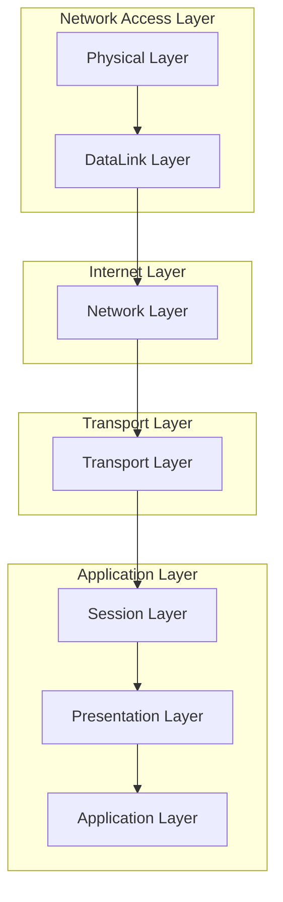

> TCP/IP 4계층 정리
# 1. TCP/IP 4계층이란?
기존 [OSI 7계층](obsidian://open?vault=markdown_docs&file=Tech%2FCS%2FNetwork%2FOSI_7_Layers)이 기준에 대한 명확한 관점 등을 표현한 것이라면 TCP/IP 4계층은 실제 인터넷에서 쓰이고 있는 TCP/IP 프로토콜 기반으로 보다 단순화한 계층 모델이다.

## 1-1. Network Access Layer : 네트워크 연결 계층
[OSI 7계층](obsidian://open?vault=markdown_docs&file=Tech%2FCS%2FNetwork%2FOSI_7_Layers)의 Physical Layer와 DataLink Layer에 해당한다.
물리적인 주소인 MAC 주소를 기반으로 프레임 및 패킷 등을 송수신한다.
- LAN, 패킷망 등에 사용
## 1-2. Internet Layer : 인터넷 계층
[OSI 7계층](obsidian://open?vault=markdown_docs&file=Tech%2FCS%2FNetwork%2FOSI_7_Layers)의 Network Layer 에 해당한다.
통신 노드 간의 IP 주소를 통한 라우팅 기능 제공
- 주요 프로토콜 : IP, ARP, RARP 등
## 1-3. Transport Layer : 전송 계층
[OSI 7계층](obsidian://open?vault=markdown_docs&file=Tech%2FCS%2FNetwork%2FOSI_7_Layers)의 Transport Layer에 해당한다.
통신 노드 간의 연결을 제어하고, 신뢰성 있는 데이터 전달 제공
- 주요 프로토콜 : [TCP, UDP](obsidian://open?vault=markdown_docs&file=Tech%2FCS%2FNetwork%2FTCP_UDP) 등
## 1-4. Application Layer : 응용 계층
[OSI 7계층](obsidian://open?vault=markdown_docs&file=Tech%2FCS%2FNetwork%2FOSI_7_Layers)의 Session, Pregentation, Application Layer에 해당한다.
TCP/UDP 기반 전달받은 데이터에 대한 후처리 및 응용프로그램 내 출력 등을 담당
- 주요 프로토콜 : HTTP, FTP, SMTP 등
# Ref
- https://hahahoho5915.tistory.com/15