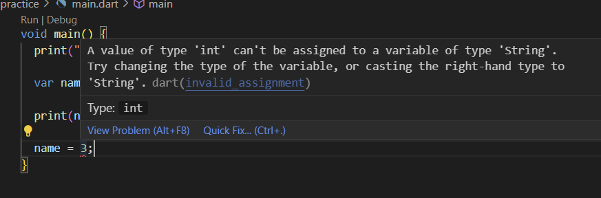

# Chapter01. Variables
# 1. Dart의 진입점

여러 객체지향 언어에서와 마찬가지로 Dart 또한 프로그램 실행 시 최초 진입하는 메소드가 사전에 약속되어 있다.

```dart
void main() {
  print("Hello Dart");
}
```

JAVA나 C 등과 같이 main() 이라는 이름을 지닌 함수가 해당 프로그램의 진입 함수로 정의된다.

만약 그러한 함수가 없을 경우에는 정상적으로 프로그램이 실행되지 않는다.

# 2. 변수 선언

## 2-1. var 키워드

javascript나 kotlin 등 일부 언어에서 사용하는 var 키워드와 같은 묵시적인 타입을 선언할 때 사용하는 var 키워드를 제공한다.

```dart
void main() {
  print("Hello Dart");

  var name = "guardjo";
}
```

위 예시를 보면 var 타입의 name에 실제로는 String(문자열)타입을 정의한것을 볼 수 있다. dart는 var타입으로 지정된 변수의 경우 이후 주입되는 데이터에 따라 실제 타입을 추론할 수 있다.

- 단, 위와 같이 String으로 이미 추론된 name이라는 변수는 이후 같은 String 타입으로만 값을 변경할 수 있음



	이미 추론된 var 변수 내 다른 타입을 주입할 경우
    
> [!NOTE]
> **var 키워드를 통한 묵시적 타입 추론과 명시적 타입 지정에 대한 견해**
>  
>  google에서 제공하는 Dart의 스타일 가이드라인에 따르면 var 키워드 같은 경우 함수나 메소드 내에서 변수를 선언할 때 주로 사용하길 권장하며 전역 변수와 같이 class 내 메소드나 함수 상위에 선언되는 변수들에 대해서는 String과 같은 명시적인 타입을 지정하도록 권장하고 있다.

## 2-2. Dynamic 키워드

앞선 var 키워드 사용 시 특정 값을 주입하게 되면 해당 var 타입은 주입받은 값의 타입을 추론하여 해당 타입으로 변환된다.

이때 아래와 같이 var 타입의 변수에 값을 입력하지 않았을 경우에는 dynamic 변수로 취급된다.


추론되지 않은 var 변수에 대한 실제 반환 타입(dynamic)

```dart
void main() {
  dynamic dynamicValue;

  if (dynamicValue is String) {
    // dynamic 타입이 String 타입으로 지정된 경우, String 함수 사용가능
    dynamicValue.isEmpty;
  }

  if (dynamicValue is int) {
    // dynamic 타입이 int 타입으로 지정된 경우, int 함수 사용가능
    dynamicValue.isEven;
  }
}
```

특정 상황에서 하나의 변수에 여러 데이터 타입이 들어올 수 있는 경우 위와 같이 dynamic 키워드를 통해 동적으로 변수 타입을 지정할 수 있으며, 블럭 단위에서 해당 변수의 타입이 결정될 경우 해당 타입에 대한 함수 및 계산 등을 사용할 수 있다.

## 2-3. ? 키워드

Dart에서는 기본적으로 모든 변수 타입들은 nullable하지 않는다. 허나 null이라는 값은 하나의 주요 요소로 사용할 수 있는 값이다보니, “?” 키워드를 사용해서 해당 변수에 null이 올 수 있음을 명시하여 null 값에 대한 대처를 할 수 있게 지원한다.


```dart
void main() {
	...
  String? nullableValue = null;
}
```

? 키워드를 사용하지 않았을 경우에는 기본적인 타입으로써 nullable을 지원하지 않는다. 이때 해당 변수 타입 뒤에 ? 키워드를 사용함으로써 해당 변수를 nullable하게 지정할 수 있다.


### Null safety 기능 제공

Dart에서는 nullable 타입으로 지정된 경우 런타임이 아닌 컴파일 시점에 해당 요소들을 참조할 경우  아래와 같은 경고를 제공한다.


위와 같은 경우에 대한 Null 처리는 아래와 같이 처리할 수 있다.

```dart
void main() {
  String? nullableValue = null;

  // 기본적인 조건문을 통한 null 처리
  if (nullableValue != null) {
    nullableValue.isNotEmpty;
  }

  // ? 키워드를 통한 null 처리
  nullableValue?.isNotEmpty;
}
```

기본적으로 다른 언어들처럼 조건문을 통해 null이 아닌 경우로 분기를 탈 수도 있으며, Dart에서 제공해주는 ? 키워드를 사용할 경우 보다 간단하게 null 처리를 할 수 있다.

- 참조하는 객체에 ? 키워드가 선언되어 있을 경우 null이 아닌 경우에만 해당 참조 객체에 대한 이후 처리 작업을 진행한다.

## 2-4. Final 키워드

Java의 final 키워드 혹은 Javascript의 const 키워드 등과 같은 기능을 하는 Dart의 키워드이다. 다른 언어들과 마차나지로 final 키워드를 붙일 경우 해당 변수는 값 할당을 한번만 할 수 있는 상수, 불변한 값을 지니게 된다.

```dart
void main() {
  // final 키워드를 통한 상수 할당
  final String constValue = "const";

  print(constValue);
}
```

위와 같이 선언해서 사용할 수 있으며, final로 작성된 변수는 이후 값을 변경할 수 없으며, 변경하려할 경우 경고를 보여준다.

또한 final 키워드와 함께 데이터 타입도 명시할 수는 있으나, 묵시적으로 처리하여도 컴파일러가 알아서 데이터 타입을 추론해주기 떄문에 필수적으로 작성할 필요는 없다.

## 2-5. Late 키워드

Dart에서는 var 혹은 final 키워드를 사용하는 변수에 값을 나중에 할당해주도록 지원하기도 한다. late 키워드를 사용할 경우 해당 변수에 아무런 값을 할당하지 않아도 이후 값 할당을 지원한다. 

```dart
void main() {
  // late 키워드를 통한 지연 할당

  late final String lateValue;

  lateValue = "lateValue";

  print(lateValue);
}
```

위와 같이 final 변수인 경우 값 할당을 안한채로 변수를 생성 후 이후 최초 1회에 한해 값을 할당해줄수 있도록한다.

- 또한 late 키워드가 붙은 변수의 경우 값이 할당되기 전에 관련 변수를 사용할 경우 Dart에서 사용할 수 없다는 경고 메시지를 전달해준다.
    
    
    
    late 변수에 값이 할당안되어 있을 경우
    

## 2-6. Const 키워드

Javascript의 const는 final과 비슷하며 Dart에서의 Const는 굳이 표현하자면 Java의 static 키워드와 비슷하다.

```dart
void main() {
  // const 키워드를 통한 컴파일 시점 값 할당
  const API_KEY = "test-key";

  print(API_KEY);
}
```

위 예시처럼 특정 변수를 const 키워드로 지정할 경우 해당 변수의 값은 컴파일 시점에 할당된다. 이는 java의 static 키워드가 컴파일 시점에 메모리에 로딩되는것과 같다고 볼 수 있다.

또한 Javascript와 마찬가지로 한번 값을 할당하면 이후에 변경할 수 없는 상수 성격도 지니고 있다.

이를 통해 앱 배포 전, 패키징을 통해 특정 값들을 미리 로딩해서 사용할 필요가 있는 경우 const 키워드를 사용하면 된다.

- ex) API 키값을 저장해두는 변수
    - `const String API_KEY = “test-key”;`

> [!NOTE] 
> **const 키워드 변수에 할당할 수 없는 요소**
> 
> const 키워드 변수의 경우, 컴파일 시점에 값을 할당하기에 컴파일 시점에 알 수 없는 데이터들은 const 변수의 값으로 할당 할 수 없다.
> 
> 예를 들어 아래와 같이 `DateTime.now()` 를 통해 현재 실행 시점 시간을 구할 경우, const 변수는 실행 시점이 아닌 컴파일 시점에 값을 할당하기에 `DateTime.now()` 값을 가져오지 못하여, 아래와 같이 경고를 보여준다.
> 

