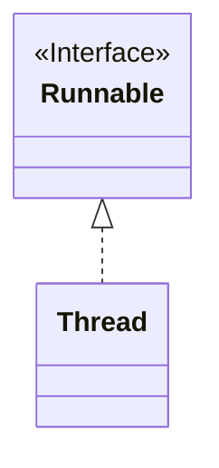

> Java에서 제공하는 Runnable 인터페이스

# Runnable
Java에서 `Thread`를 생성하는 방식에는 **Thread** 객체를 상속하여 `run()` 메소드를 재정의하는 방법과, **Runnable** 인터페이스를 기반으로 구현체를 구성하여 사용하는 방식이 있다.

```java
public interface Runnable {  
    void run();  
}
```

**Runnable** 인터페이스는 위와 같이 정의되어 있으며, `run()` 메소드 내에 `Thread`에 할당할 작업을 구현하면 된다.
## Runnable 작업 수행
**Runnable** 인터페이스에 대한 구현체를 기반으로 `Thread` 를 할당하여 작업을 수행하려면 아래와 같이 구성해야 한다.
```java
public class CustomTask implements Runnable{  
    @Override  
    public void run() {  
        System.out.println(Thread.currentThread().getName() + " : Start");  
        System.out.println(Thread.currentThread().getName() + " : End");  
    }  
}
...
public class RunnableMain {  
    public static void main(String[] args) {  
        System.out.println(Thread.currentThread().getName() + " : Start");  
  
        Runnable task = new CustomTask(); // Runnable 구현체 인스턴스 생성
        Thread thread = new Thread(task); // Thread 인스턴스 생성 시 Runnable 인스턴스 주입
        thread.start();  
  
        System.out.println(Thread.currentThread().getName() + " : End");  
    }  
}
```

위와 같이 **Runnable** 구현체를 Java에서 제공하는 **Thread** 객체 인스턴스 생성 시에 인자로 주입해줄 수 있으며, 이를 통해 해당 **Thread** 인스턴스를 실행할 경우, 내부적으로 인자로 주입한 **Runnable** 구현체의 작업을 수행하게 된다.

## Runnable과 Thread의 관계


Java에서 제공하는 **Thread** 객체와 **Runnable** 인터페이스는 크게 위와 같은 관계로 이루어져 있다. 결국 **Thread** 객체 자체도 **Runnable** 인터페이스에 대한 구현체 중 하나이며, **Thread** 객체의 `run()` 메소드 자체가 **Runnable** 인터페이스에 정의된 요소이다.

### Thread와 Runnable 비교
**Thread** 객체를 기반으로 한 `Thread` 작업 수행과 **Runnable** 인터페이스를 기반으로 한 `Thread` 작업 수행은 아래와 같은 장/단점이 존재한다.

#### Thread 상속
**장점** 
- **Runnable** 에 비해 간단하게 사용할 수 있음
**단점**
- **Thread** 객체를 상속 받아야 하기에, 이미 다른 객체를 상속 받았을 경우, 사용할 수 없음
- **Thread** 객체의 `run()` 메소드 뿐만 아니라, 작업에 필요 없는 요소들도 포함됨

#### Runnable 구현
**장점**
- 작업과 `Thread`의 명확한 분리에 의한 가독성 향상
- 동일한 작업 (**Runnable**)을 다른 여러 **Thread**에 할당 할 수 있음
- 별도의 객체를 상속받을 수 있음

**단점**
- **Runnable** 구현체를 **Thread**에 주입시켜야 하므로, 코드가 상대적으로 복잡해질 수 있음
