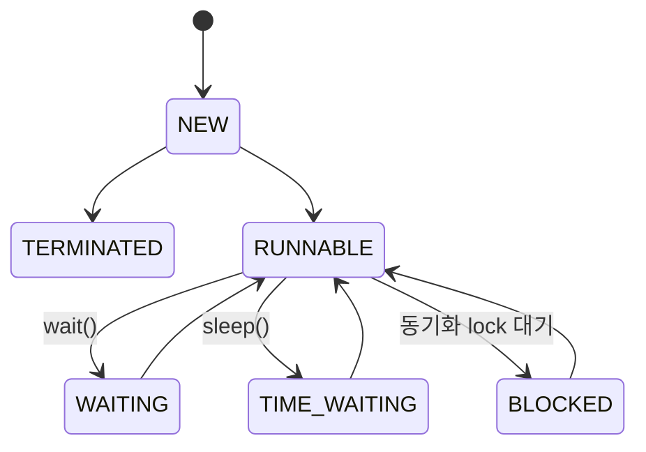

> Java의 Thread의 생명주기

# [Thread의 생명 주기](../ReactiveJava/2.%20Java%20Thread%20Basic/Thread%20Lifecycle%20and%20State.md)

JVM에서 생성되고 관리되는 `Thread`는 위와 같은 생명주기를 통해 **Thread**의 `state`가 변경되며, 이에 따라 JVM 및 OS의 스케줄러 큐에 포함시키거나 제외된다.

## Thread 상태
### NEW
최초 신규 **Thread** 객체 인스턴스를 생성한 후 별도의 `start()` 메소드 호출 없이 메모리에 인스턴스만 적재되어 있는 상태일 때는 `NEW` 상태로 지정된다.
```java
Runnable runnable = () -> {  
    // task  
};  
Thread newThread = new Thread(runnable, "New Thread");  
// newThread.start();
```

위와 같이 인스턴스 생성 이후 `start()` 호출 전에 `state` 속성을 조회할 경우 `NEW` 상태를 반환한다.
### RUNNABLE
현재 해당 **Thread** 인스턴스가 실행 가능한 상태라는 것을 뜻하며, 이는 JVM 및 OS의 `Thread` 스케줄러의 스케줄링에 의해 대기 큐에 적재되어 있거나, 현재 실제 CPU가 점유하여 실행중인 `Thread`를 뜻한다.

일반적으로 OS의 작업 스케줄러가 **Multi Thread**를 처리할 때에는 짧은 시간 내에 `Context Switching`이 발생하면서 지속적으로 대기 큐에 존재하는 `Thread`들을 번갈아가면서 수행하기에, 실제 CPU에 할당되어 작업 중인지 여부는 확인 할 수 없다.
### BLOCKED
**Multi Thread** 환경에서 특정 요소에 대한 동기화 작업이 필요할 경우 `lock`이 발생할 수 있으며, 이에 따라 현재 작업 중인 `Thread`가 이러한 `lock`에 의해 차단된 상태를 뜻한다.

```java
class SynchronizeThread implements Runnable {
    @Override
    public void run() {
        synchronized (this) {
            sync();
        }
    }

    private void sync() {
        Logger.log("Sync!");
    }
}
...
public static void main(String[] args) {
    Thread thread1 = new Thread(new SynchronizeThread());
    Thread thread2 = new Thread(new SynchronizeThread());

    thread1.start();
    thread2.start();
}
```

위와 같이 `synchronized` block에 여러 `Thread`가 접근할 경우 이미 점유한 `Thread`에서 `lock`을 풀 때 까지 대기하는 `Thread`의 상태가 이와 같다.
### WAITING
`Thread`에서 작업을 처리하던 와중에 다른 `Thread`의 응답을 기다리거나 별도 메소드 호출을 통해 대기 상태로 변환된 `Thread`를 뜻한다.

```java
Thread thread1 = new Thread(runnable);
Thread thread2 = new Thread(runnable);

thread1.start();
thread1.wait(); // thread1은 WAITING 상태로 전환
thread2.start();
```

위와 같이 **Thread**의 `wait()` 혹은 `join()` 메소드를 호출하여 대기상태로 전환할 수 있다.
### TIME_WAITING
**WAITING** 상태와 비슷하게 대기상태로 전환된 `Thread`를 뜻하나, **WAITING**과 달리 대기 상태로 존재하는 시간이 정해져 있으며, 해당 시간이 지난 이후에는 **Thread 생명주기**에 따라 상태가 변경되게 된다.

```java
public static void main(String[] args) throws InterruptedException {
    ...
    Thread.sleep(1000); // 현재 실행 중인 Thread를 1000ms 동안 대기상태로 전환
    ...
}
```

주로 위와 같이 `sleep()` 메소드 호출이나, 시간 관련 인자값이 추가된 `wait()` 메소드 호출 시에 전환되는 상태를 뜻한다.
### TERMINATED
해당 **Thread** 인스턴스에 할당된 작업이 모두 종료된 후, JVM의 메모리 영역 중 해당 `Thread`의 `Stack 영역`이 해제된 상태를 뜻한다.
- JVM의 `Thread`는 해당 상태 이후엔 다시 작업을 수행할 수 없다.

