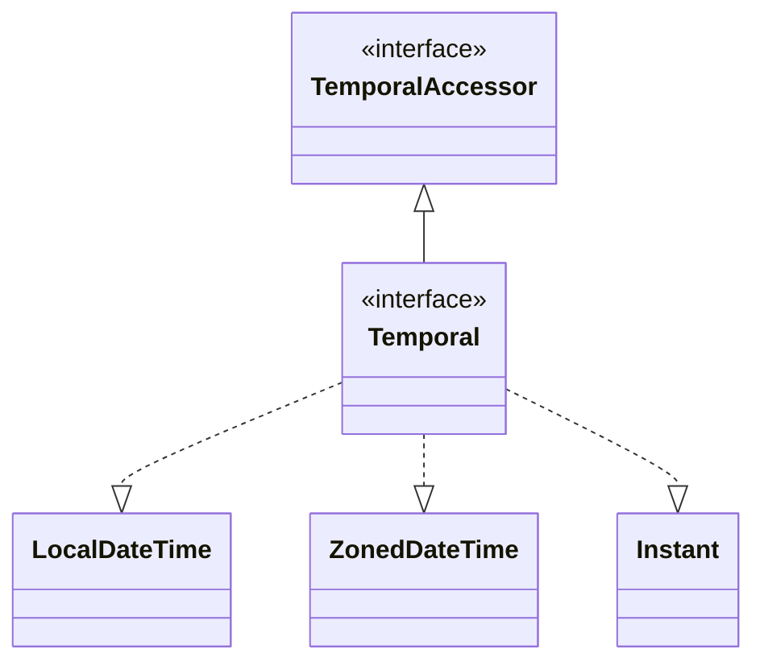
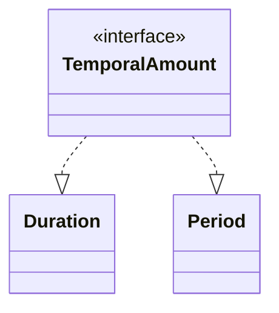
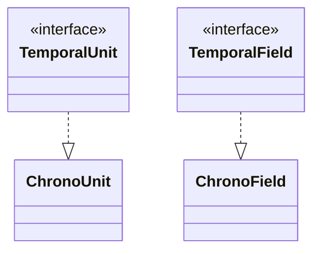

> Java의 날짜 및 시간 관련 지원 요소
# 날짜 및 시간 관련 라이브러리
세계적으로 많이 쓰이는 그레고리력 기준 날짜 및 시간 계산 시에는 윤년 계산, Timezone 고려, DST 등의 정책에 의한 시간 변경 등 고려해야할 사항이 많다.
그렇기에 Java에서는 초기부터 날짜 및 시간 관련 객체 및 인터페이스들을 제공해 왔다.

- **Timezone** : 영국 그리니치를 표준시(GMT)로 하여 국가 및 지역 별 시간 차에 대한 요소
	- *한국의 경우 GMT +9 의 시차를 지니고 있음*
- **DST** : 일광 절약 시간이라고 하며, 일부 국가에서는 여름 및 겨울에 일출, 일몰 시간이 늘어남에 따라 낮 시간대에 1시간을 더하는 기간
	- *독일의 경우 3월부터 10월 까지는 기존 시간대에 +1시간을 더함*
## Date
```java
Date date = new Date(); // 현재 시간 반환
```
Java 1.0부터 탑재되어 있던 날짜 관련 객체로 주로 그레고리력 기준 날짜 계산을 위해 구성되었다.
하지만 초기 버전이기에 `Timezone`이 지원되지 않으며, 불변 객체가 아니기에 `SideEffect`가 발생할 요지가 있다.

## Calendar
Java 1.1에서 `Date` 객체의 문제점 중 하나인 `Timezone` 관련 사항이 적용된 객체다. 주로 아래와 같이 선언되며, 상대적으로 선언 및 사용이 불편한 단점이 존재한다. 
```java
Calendar calendar = Calendar.getInstance(); // Calendar 인스턴스 초기화  
  
TimeZone berlinTimeZone = TimeZone.getTimeZone("Europe/Berlin"); // 독일 베를린 기준 Timezone 설정  
Calendar berlinCalendar = Calendar.getInstance(berlinTimeZone); // 독일 베를린 기준 Calendar 인스턴스 초기화
```

또한 `Date`와 마찬가지로 불변객체가 아니기에 값이 변경 될 수 있으며, `Multi Thread` 환경에서 `Thread Safe`하지 않는 문제도 여전히 내포하고 있다.

## java.time
`Date`, `Calendar` 패키지에 대해 많은 문제가 존재하여 Java 1.8에서 대대적으로 개선하여 출시된 객패키지이다.
이전 `Date`, `Calendar` 에서 문제가 되던 가변 객체로 인한 `Thread Safe` 및 `Side Effect` 발생 가능을 원천 차단할 수 있도록 불변 객체들로 구성되었으며, 다양한 인터페이스 및 메소드들을 지원한다.

```java
LocalDate localDate = LocalDate.now(); // 2024-09-11  
LocalTime localTime = LocalTime.now(); // 00:36:46.366730900  
LocalDateTime localDateTime = LocalDateTime.now(); // 2024-09-11T00:36:46.366730900  
Instant instant = Instant.now(); // 2024-09-10T15:36:46.366730900Z  
ZonedDateTime zonedDateTime = ZonedDateTime.now(); // 2024-09-11T00:36:46.367730700+09:00[Asia/Seoul]
```

이러한 점으로 인해 오늘날에는 `java.time` 패키지를 주로 권장하며 사용되고 있다.

## java.time 패키지 제공 정보
java 1.8에서부터 제공하는 `java.time` 패키지 내 시간 및 날짜 관련 객체들은 아래와 같은 시간 관련 속성들을 제공한다.

| Class/Enum     | Year | Month | Day | Hour | Minuites | Seconds | Zone Offset | Zone ID |
| -------------- | ---- | ----- | --- | ---- | -------- | ------- | ----------- | ------- |
| Instant        |      |       |     |      |          | O       |             |         |
| LocalDate      | O    | O     | O   |      |          |         |             |         |
| LocalDateTime  | O    | O     | O   | O    | O        | O       |             |         |
| LocalTime      |      |       |     | O    | O        | O       |             |         |
| ZonedDateTime  | O    | O     | O   | O    | O        | O       | O           | O       |
| OffsetDateTime | O    | O     | O   | O    | O        | O       | O           |         |
| OffsetTime     |      |       |     | O    | O        | O       | O           |         |
| Year           | O    |       |     |      |          |         |             |         |
| YearMonth      | O    | O     |     |      |          |         |             |         |
| Month          |      | O     |     |      |          |         |             |         |
| MonthDay       |      | O     | O   |      |          |         |             |         |
| Duration       |      |       |     |      |          | O       |             |         |
| Period         | O    | O     | O   |      |          |         |             |         |
위와 같이 객체들마다 제공하는 속성들이 다르며, 각 상황에 맞게 관련 객체 및 메소드를 사용할 수 있다.
- **Zone Offset** : UTC 기준에서 얼마만큼의 차이가 존재하는지를 나타냄
	- ex) 한국의 경우 UTC +9
- **ZoneId** : 해당 시간대가 어느 지역의 Timezone인지를 나타냄
	- ex) 한국의 경우 Asia/Seoul
	- 또한 Timezone 정보를 알고 있기에 `DST`(일광 적용 시간 : Summer Time)이 적용됨

# LocalDateTime
Java에서 `Timezone` 정보를 제외한 현재 지역에 대한 날짜 및 시간에 대한 정보 제공 및 가공을 위한 객체로 `LocalDate`, `LocalTime`, `LocalDateTime` 객체를 제공한다.

## LocalDate
현재 JVM에 설정된 `Timezone` 기반의 날짜 정보를 제공하는 객체로 아래와 같이 선언되며 사용할 수 있다.
```java
LocalDate now = LocalDate.now(); // 현재 날짜 (2024-09-18)
LocalDate ofDay = LocalDate.of(2024, 3, 21); // 특정 일자 (2024-03-21)

LocalDate plusDay = ofDay.plusDays(1); // 2024-03-22  
LocalDate minusMonth = ofDay.minusMonths(1); // 2024-02-21
```
주로 `now()` 및 `of()` 메소드를 통해 인스턴스를 생성하며, 불변객체로 반환되기에 여러 계산 작업 시에는 반환된 값을 별도 인스턴스로 매핑해주어야 한다.

## LocalTime
현재 JVM에 설정된 `Timezone` 기반의 시간 정보를 제공하는 객체로 아래와 같이 선언하여 사용할 수 있다.
```java
LocalTime now = LocalTime.now(); // 현재 시간 반환 (23:31:58)
LocalTime ofTime = LocalTime.of(10, 30, 15); // 특정 시간 반환 (10:30:15)  
  
LocalTime after1Hour = ofTime.plusHours(1); // 1시간 더하기 (11:30:15)
LocalTime before1Hour = ofTime.minusHours(1); // 1시간 빼기 (09:30:15)
```

## LocalDateTime
내부적으로 `LocalDate` 객체와 `LocalTime` 객체를 지닌 객체로 날짜와 시간정보를 함께 제공한다.
```java
public final class LocalDateTime  
        implements Temporal, TemporalAdjuster, ChronoLocalDateTime<LocalDate>, Serializable {
    ...
    private final LocalDate date;  
    private final LocalTime time;
	 ...
}
```
```java
LocalDateTime now = LocalDateTime.now(); // 현재 날짜 및 시간 (2024-09-18T23:34:02)
LocalDateTime ofDatetime = LocalDateTime.of(2024, 03, 15, 10, 15, 30); // 특정 날짜 및 시간 (2024-03-15T10:15:30)  
  
boolean isBefore = ofDatetime.isBefore(now); // True  
boolean isAfter = ofDatetime.isAfter(now); // False
```
## 주요 메소드
### 생성
현재 날짜/시간 및 특정 날짜/시간에 대한 신규 인스턴스를 생성할 수 있도록 `Factory Pattern Method`를 제공한다.
- **now()** : 현재 날짜 정보를 지닌 `LocalDate` 인스턴스를 생성
- **of(int, int, int)** : 연, 월, 일 정보를 입력하여 해당 날짜에 대한 인스턴스를 생성
- **of(int, int, int, int, int)** : 연, 월, 일, 시, 분 등 정보를 입력하여 해당 날짜에 대한 인스턴스를 생성
	- *이외에도 다양한 인자를 기반으로 하는 날짜 인스턴스 반환 메소드 제공*
### 계산
각 객체는 불변객체이기에 연산 관련 메소드 수행 시 연산 결과에 대한 신규 인스턴스가 반환된다.
- **plusXxx()** : 연, 월, 일 별 덧셈 연산 결과 반환
- **minusXxx()** : 연, 월, 일 별 뺄셈 연산 결과 반환

### 비교
- **isBefore(d)** : 현재 날짜 및 시간 객체가 인자로 주어진 시간대보다 이전인지 여부 반환
- **isAfter(d)** : 현재 날짜 및 시간 객체가 인자로 주어진 시간대보다 이후인지 여부 반환
- **isEquals(d)** : 현재 날짜 및 시간 객체가 인자로 주어진 시간대와 동일한지 여부 반환

> [!NOTE]
> **isEquals()와 equals()의 차이**
> 
> `java.time` 내 시간대 관련 객체들에서 `overriding`된 `equals()`는 인스턴스의 타입 및 `Timezone`, 시간대 값이 모두 같은지 여부를 판단하는데 반해, `isEquals()`의 경우 `Timezone` 여부와 관계 없이 동일한 시간대임을 나타낼 경우 동일한 값으로 판단한다.
> 
> - 예를 들어 한국의 9시와 UTC 기준 0시는 동일한 시간대 이기에 `isEquals()`는 `True`를 반환하지만, `equals()`는 `Timezone` 및 시간값 자체가 다르기에 `False`를 반환한다.

# ZonedDateTime
앞선 `LocalDateTime` 에 UTC 기준 차이에 대한 offset 및 `Timezone`에 대한 정보가 추가된 객체로, 특정 `Timezone`에 대한 시간대 및 일광 절약 시간 (`SummerTime`) 등에 대한 정보가 반영된 객체이다.

```java
public final class ZonedDateTime  
        implements Temporal, ChronoZonedDateTime<LocalDate>, Serializable {  
	...
    private final LocalDateTime dateTime;  
    private final ZoneOffset offset;  
    private final ZoneId zone;
    ...
}
```

```java
ZonedDateTime now = ZonedDateTime.now(); 
// 2024-09-18T23:56:33.342942200+09:00[Asia/Seoul]
```

내부적으로는 위와 같이 `LocalDateTime` 객체와 `Timezone` 정보를 다루는 `ZoneId` 객체, offset 정보가 포함된 `ZoneOffset` 객체로 이루어져 있다.

## ZoneId
`ZonedDateTime` 객체에서 쓰이는 객체로써 `Timezone` 정보를 다루는 객체이며, 크게 아래와 같은 `TimeZone`들을 기본 제공해준다.
```java
/* ...
Asia/Seoul
Australia/Sydney
America/Lima
Australia/LHI
America/St_Lucia
Europe/Madrid
America/Bahia_Banderas
America/Montserrat
Asia/Brunei
America/Santa_Isabel
Canada/Mountain
America/Cambridge_Bay
Asia/Colombo
Australia/West
... 등을 포함한 수백 가지 TimeZone 지원 */
ZoneId.getAvailableZoneIds(); // ZoneId 지원 가능 목록 반환
```

## OffsetDateTime
`ZonedDateTime`에 `TimeZone` 관련 정보만 제거하여 offset 계산만 적용된 날짜 및 시간 정보를 반환해준다.
```java
public final class OffsetDateTime  
        implements Temporal, TemporalAdjuster, Comparable<OffsetDateTime>, Serializable {
    ...
	private final LocalDateTime dateTime;  
	private final ZoneOffset offset;
	...
}
```

```java
OffsetDateTime offsetNow = OffsetDateTime.now();
// 2024-09-18T23:58:44.523946600+09:00
```

`ZonedDateTime`과 마찬가지로 현지 뿐 아니라 글로벌 서비스 시에 고려될만한 객체이며, `ZonedDateTime`과 다르게 `ZoneId`가 존재하지 않아 일광 절약 시간 등의 계산을 제외한 날짜 및 시간 처리 시에 사용하는것이 바람직하다.

# Instant
`Instant`는 `LocalDateTime`, `ZonedDateTime`와 같은 날짜 표기 데이터와 다르게 단순히 특정 시간대 이후로 경과한 초 및 나노초 단위 데이터를 표현하는 객체이다.
```java
public final class Instant  
        implements Temporal, TemporalAdjuster, Comparable<Instant>, Serializable {
        ...
        private final long seconds;
        private final int nanos;
        ...
}
```

위와 같이 특정 시간 (`EPOCH`) 이후로 경과된 초 데이터와 나노초 데이터가 포함되어 있다.
- **EPOCH** : 특정 시간대를 뜻하며, `Instant`객체의 경우 1970-01.01 00:00:00 시간대를 기준점으로 한다.
> [!NOTE]
> `Instant`객체의 경우 `ZonedDateTime`, `LocalDateTime`과 다르게 단순 `EPOCH`기준 흐른 시간값을 지니고 있기에, 날짜 연산 등에 작업에는 적절하지 않으나, 로그 시간대, 접근 시간대 확인 및 경과 시간 등에 대한 계산 등에는 어느 장소에든 구애 받지 않는 절대적인 기준 값을 지니기에 적절하게 사용할 수 있다.
## 주요 메소드
`Instant` 객체에서 제공하는 메소드들은 주로 다음과 같이 구성되어 있다.
### 생성
```java
// 생성
Instant now = Instant.now(); 
// 현재 기준 시간 반환 (2024-09-19T13:47:22.614519700Z)  

ZonedDateTime zonedDateTime = ZonedDateTime.now(); 
// 2024-09-19T13:47:22.614519700Z  

Instant fromZoneTime = Instant.from(zonedDateTime); 
// ZonedDateTime 기반 시간 반환 (2024-09-19T13:47:22.614519700Z)  

Instant epochStart = Instant.ofEpochSecond(10L); 
// EPOCH_TIME(1970.01.01) 기준 10초 뒤 시간 반환 (1970-01-01T00:00:10Z)
```
- **now()** : 현재 기준 `EPOCH`로부터 경과한 시간을 반환함
	- *어느 `TimeZone`이든 동일한 시점에는 동일한 값을 반환함*
- **from(TemporalAccessor)** : `ZonedDateTime`과 같은 `TemporalAccessor` 인터페이스 구현체에 대한 `Instant` 객체를 생성함
- **ofEpochSecond(long)** : `EPOCH` 기준에서 인자로 주어진 초만큼 진행된 시간대 값을 반환함
### 계산
`LocalDateTime`, `ZonedDateTime`과 마찬가지로 덧셈 및 뺄샘을 통한 시간대 합계 및 차이 값을 계산할 수 있도록 구성되어 있다.
```java
// EPOCH_TIME(1970.01.01) 기준 10초 뒤 시간 반환 (1970-01-01T00:00:10Z)
Instant epochStart = Instant.ofEpochSecond(10L);

// 1970-01-01T00:00:20Z  
Instant after10s = epochStart.plusSeconds(10);  
  
// 1970-01-01T00:00:00Z  
Instant before10s = epochStart.minusSeconds(10);
```
- **afterXxx()** : 초, 밀리초, 나노초 등을 기반으로 덧셈 연산을 지원함
- **beforeXxx()** : 초, 밀리초, 나노초 등을 기반으로 뺄셈 연산을 지원함
# Period / Duration
`LocalDateTime`, `ZonedDateTime`, `Instant` 등은 특정 시간대를 나타내는 객체이며, Java에서는 이외에도 날짜나 시간에 대한 시간의 간격, 기간을 나타내는 정보를 지닌 객체를 제공한다.
## Period
날짜 기준 기간 정보를 나타내는 객체로 내부적으로는 연, 월, 일 정보를 지니고 있다.
```java
public final class Period implements ChronoPeriod, Serializable {
	private final int years; 
	private final int months;  
	private final int days;
	...
}
```

각 필드 값을 반환하는 `getXXX()` 메소드를 기본적으로 지원하며 아래와 같이 다양한 메소드를 통해 특정 기간 및 기간에 대한 연산, 두 특정 시간대에 대한 기간 차이 계산 등을 지원한다.

```java
// 10일  
Period period = Period.ofDays(10);  
System.out.println(period);  
  
// 2024-03-01  
LocalDate localDate = LocalDate.of(2024, 3, 1);

// 2024-03-01 + 10일 = 2024-03-11
LocalDate plusPeriod = localDate.plus(period);  
  
// 2024-05-05  
LocalDate beforeDate = LocalDate.of(2024, 5, 5);  
  
// 2024-06-06  
LocalDate afterDate = LocalDate.of(2024, 6, 6);  
  
// afterDate와 beforeDate의 기간 차이 (1개월 1일)  
Period between = Period.between(beforeDate, afterDate);  
System.out.println(between.getMonths() + "개월 " + between.getDays() + "일");
```

## Duration
시간 기준 기간 차이 정보를 제공하는 객체로 내부적으로 초, 나노초 값을 지니고 있다.
```java
public final class Duration implements TemporalAmount, Comparable<Duration>, Serializable {
	...
	private final long seconds;
	private final int nanos;
	...
}
```
위와 같이 값 자체는 초와 나노초 값만 지니고 있지만 해당 값들을 기반으로 시, 분 값을 계산할 수 있기에 `toHours()`, `toMiniutes()` 메소드 등을 제공한다.

뿐만 아니라 `Period`객체와 마찬가지로 아래와 각종 계산 및 생성 메소드를 지원한다.
```java
// 01:00  
Duration duration = Duration.ofHours(1);  
  
// 01:30  
LocalTime localTime = LocalTime.of(1, 30, 0);  
  
// 01:00 + 01:30 = 02:30  
LocalTime plus1Hour = localTime.plus(duration);  
  
// 01:30:00  
LocalTime startTime = LocalTime.of(1, 30, 0);  
// 03:00:00  
LocalTime finishTime = LocalTime.of(3, 0, 0);  
  
// 01:30:00 과 03:00:00의 시간차 = 1시간 30분  
Duration between = Duration.between(startTime, finishTime);  
System.out.println(between.toHours() + "시간 " + between.toMinutesPart() + "분");
```

> [!INFO]
> **getHours(), getMinutes() 가 아닌 toXxx()인 이유**
> `Duration`은 내부적으로 초/나노초 값만 지니고 있기에 시, 분 단위 반환 메소드의 경우 내부적으로 계산 로직이 포함되어 있기에 `toXxx()` 형태의 메소드로 제공하고 있다.

> [!INFO]
> **toMinutes() 와 toMinutesPart()의 차이**
> 
> `toMinutes()`의 경우 기간 내 분 값 전체를 뜻하며, 예를 들어 `Duration`이 1시간 30분인 경우 90분을 반환한다.
> 이에 반해 `toMinutesPart()`의 경우 시 값을 제외한 나머지 분 값을 뜻하며 `Duration`이 1시간 30분인 경우, 1시를 제외한 나머지인 30분을 반환한다.
> - `toMillis()`와 `toMillisPart()`도 동일하다.

# java.time 주요 인터페이스
`java.time` 내 대부분의 객체는 특정 인터페이스에 대한 구현체이며, 각각의 인터페이스는 크게 특정 시각을 나타내거나, 기간을 나타내는 등 정해진 범위 별로 인터페이스가 나뉘어져 있다.
## 시각을 나타내는 인터페이스
`java.time`에서는 특정 시각을 나타내는 인터페이스로 `TemporalAccessor`와 `Temporal`을 제공한다.

### TemporalAccessor
`LocalDateTime`, `ZonedDateTime` 등과 같이 특정 시각을 나타내는 구현체들에 대한 최상위 인터페이스로 주로 아래와 같은 메소드를 제공한다.
```java
public interface TemporalAccessor {
	...
	boolean isSupported(TemporalField field);
	long getLong(TemporalField field);
	...
}
```

`TemporalAccessor`의 경우 주로 특정 시간대에 대한 조회 및 반환 값에 대한 인터페이스를 제공한다.

### Temporal
`Temporal`의 경우 `TemporalAccessor` 인터페이스를 상속 받은 인터페이스로 `TemporalAccessor`와 마찬가지로 특정 시간(시각)에 대한 구현체들의 상위 인터페이스이다.
```java
public interface Temporal extends TemporalAccessor {
	...
	Temporal with(TemporalField field, long newValue);
	Temporal plus(long amountToAdd, TemporalUnit unit);
	...
}
```

주로 위와 같이 특정 시간대의 객체를 생성하거나, 계산을 지원하는 인터페이스를 제공하며, `TemporalAccessor`를 상속 받기에 각종 조회 인터페이스도 제공한다.

## 기간을 나타내는 인터페이스
`java.time`에서는 또한 두 시간대 사이의 기간 등을 나타내는 `TemporalAmount` 인터페이스를 제공한다.

### TemporalAmount
`Duration`, `Period`와 같은 어느 정도의 시간 경과(기간) 에 관련된 객체들의 상위 인터페이스이다.

```java
public interface TemporalAmount {
	...
	long get(TemporalUnit unit);
	List<TemporalUnit> getUnits();
	Temporal addTo(Temporal temporal);
	Temporal subtractFrom(Temporal temporal);
	...
}
```

주로 위와 같이 기간에 대한 연산 작업을 지원하는 인터페이스들로 이루어져 있다.

## 시간 단위를 나타내는 인터페이스
앞서 시각 및 기간을 나타내는 인터페이스 내에 제공되는 메소드들에 인자로 `TemporalField`나 `TemporalUnit`을 볼 수 있는데, 이들은 시간에 대한 값이나 영역 등 단위를 나타내는 인터페이스이다.

### TemporalUnit
시간 단위를 나타내는 인터페이스 중 하나로 경과된 시간 단위를 값으로 표현하는 메소드들을 정의한다.
```java
public interface TemporalField {
	...
	Duration getDuration();
	<R extends Temporal> R addTo(R temporal, long amount);
	long between(Temporal temporal1Inclusive, Temporal temporal2Exclusive);
	...
}
```
주로 위와 같이 경과된 초 단위 시간을 반환하거나 연산 및 비교 결과 등으로 이루어져 있다.

**ChronoUnit**
`TemporalUnit`의 대표적인 구현체로 초를 기반으로 특정 시간대의 값을 연, 월, 일로 환산하거나 시, 분, 초 등으로 환산한 Enum 구현체이다.

| ChronoUnit | 시간단위        |
| ---------- | ----------- |
| NANO       | 나노초         |
| MICROS     | 마이크로초       |
| MILLIS     | 밀리초         |
| SECONDS    | 초           |
| MINUTES    | 분           |
| HOURS      | 시           |
| HALF_DAYDS | 반나절 (오전/오후) |
| DAYS       | 일           |
| WEEKS      | 주           |
| MONTH      | 월           |
| YEARS      | 연           |
| DECADES    | 10년 주기      |
| CENTURIES  | 세기          |
| MILLENNIA  | 1000년 주기    |
| ERAS       | 시대          |
| FOREVER    | 영원          |

### TemporalField
`TemporalUnit`과 마찬가지로 시간단위를 나타내는 인터페이스이나, 내부적으로는 `ValueRange`라는 값의 범위 객체를 지니고 있어, 범위 별로 단위를 제공한다.
```java
public interface TemporalField {
	...
	ValueRange range();
	long getFrom(TemporalAccessor temporal);
	...
}
```
위와 같이 시간단위 값의 범위, 특정 시간대의 시간 단위별 값 반환 등을 제공한다.

**ChronoField**
`TemporalField`에 대한 대표적인 구현체로, 특정 월 내 일자, 연내 월 등을 나타내는 단위 객체들로 이루어진 Enum 구현체이다.
```java
/*  
NanoOfSecond, Range : 0 - 999999999  
NanoOfDay, Range : 0 - 86399999999999  
MicroOfSecond, Range : 0 - 999999  
MicroOfDay, Range : 0 - 86399999999  
MilliOfSecond, Range : 0 - 999  
MilliOfDay, Range : 0 - 86399999  
SecondOfMinute, Range : 0 - 59  
SecondOfDay, Range : 0 - 86399  
MinuteOfHour, Range : 0 - 59  
MinuteOfDay, Range : 0 - 1439  
HourOfAmPm, Range : 0 - 11  
ClockHourOfAmPm, Range : 1 - 12  
HourOfDay, Range : 0 - 23  
ClockHourOfDay, Range : 1 - 24  
AmPmOfDay, Range : 0 - 1  
DayOfWeek, Range : 1 - 7  
AlignedDayOfWeekInMonth, Range : 1 - 7  
AlignedDayOfWeekInYear, Range : 1 - 7  
DayOfMonth, Range : 1 - 28/31  
DayOfYear, Range : 1 - 365/366  
EpochDay, Range : -365243219162 - 365241780471  
AlignedWeekOfMonth, Range : 1 - 4/5  
AlignedWeekOfYear, Range : 1 - 53  
MonthOfYear, Range : 1 - 12  
ProlepticMonth, Range : -11999999988 - 11999999999  
YearOfEra, Range : 1 - 999999999/1000000000  
Year, Range : -999999999 - 999999999  
Era, Range : 0 - 1  
InstantSeconds, Range : -9223372036854775808 - 9223372036854775807  
OffsetSeconds, Range : -64800 - 64800  
 */
ChronoField.values();
```

위와 같이 각 구현체 별 범위가 제한되어 있으며, 각 제한은 실제 연도 내 월의 최대값, 월 별 일자의 최대값 등으로 이루어져 있다.

> [!NOTE]
> **ChronoUnit과 ChronoField의 차이**
> 
> 둘 다 시간 단위를 나타내는 인터페이스를 기준으로 구현된 Enum 객체이지만 `ChronoUnit`의 경우 특정 시간과 시간 사이의 경과된 시간 값을 각 Enum 타입에 맞게 연, 월, 일 등으로 표현하는데 반해 `ChronoField`의 경우 특정 시간대의 연도 값, 일자 값 등을 각각 반환받을 수 있는 Enum 타입들로 이루어져 있다.

## 복잡한 시간 계산을 위한 인터페이스
`Temporal` 인터페이스에서 `TemporalUnit` 인터페이스를 활용하여 기본적인 날짜 및 시간에 대한 연산 작업을 지원하나, 단순 숫자가 아닌 보다 복잡한 계산 시에는 일부 어려움이 있을 수 있다.

Java에서는 이러한 점을 고려하여 아래와 같이 `TemporalAdjuster`라는 인터페이스를 제공한다.
```java
public interface TemporalAdjuster {
	Temporal adjustInto(Temporal temporal);
}
```
사용자는 `adjustInfo()` 메소드를 통해 복잡한 날짜 및 시간 계산 작업을 구현할 수 있다.

### TemporalAdjusters
Java에서는 `TemporalAdjuster`에 대한 구현체 집합인 `TemporalAdjusters`를 제공하여 아래와 같이 복잡하나 일반적으로 많이 쓰일 시나리오에 대한 구현체들을 제공한다.
```java
// 2024-03-05  
LocalDate localDate = LocalDate.of(2024, 3, 5);  
  
// 다음주 금요일  
LocalDate nextFriday = localDate.with(TemporalAdjusters.next(DayOfWeek.FRIDAY));  
  
// 이번달 첫째날  
LocalDate firstDayOfThisMonth = localDate.with(TemporalAdjusters.firstDayOfMonth());
```
특정 값 변경을 위한 `with()` 메소드 자체에서 `TemporalAdjuster` 인터페이스를 인자로 받으며, 미리 구현된 일부 구현체를 통해 위와 같은 연산작업을 쉽게 구성할 수 있다.

# Parsing과 Formatting
기본적으로 `LocalDate`등과 같은 날짜 및 시간 관련 객체들은 2024-03-01와 같이 ISO 표준 형태로 `formatting` 되서 제공된다.
하지만 사용자 입장에선 보다 다양한 형태로 `formatting` 되는 경우가 많으며, 뿐만 아니라 문자열을 날짜/시간 객체로 변환하는 `parsing` 작업도 빈번하게 일어나는 작업 중 하나이다.

## DateTimeFormatter
Java에서는 이러한 시나리오를 고려하여 날짜 및 시간 관련 객체들에 대한 `Parsing` 작업과 `Formatting` 작업을 기본적으로 제공하는 `DateTimeFormatter` 객체를 지원한다.

```java
DateTimeFormatter formatter = DateTimeFormatter.ofPattern("yyyy년 MM월 dd일 HH시 mm분 ss초");  
  
// 2024-03-01T23:10:30  
LocalDateTime localDateTime = LocalDateTime.of(2024, 3, 1, 23, 10, 30);  
  
// 2024년 03월 01일 23시 10분 30초  
String formattedDateTime = localDateTime.format(formatter);  
  
String dateTimeStr = "2024년 02월 20일 10시 30분 10초";  
  
// 2024-02-20T10:30:10  
LocalDateTime parsedDateTime = LocalDateTime.parse(dateTimeStr, formatter);  
```

위와 같이 `DateTimeFormatter`를 사용하여 `DateTimeFormatter`가 시간 값을 미리 약속된 형태로 읽어 들이며 그 외의 문자들로 `formatting`하도록 한다.

또한 Java의 각 날짜 및 시간 관련 객체들은 내부적으로 `parse(String, DateTimeFormatter)` 메소드를 지원하여 약속된 형태의 문자열을 읽어 객체로 변환하도록 한다.
### DateTimeFormatter 기본 지원 포맷
`DateTimeFormatter`의 경우 아래와 같이 기본적으로 많이 쓰이는 포맷을 기본적으로 제공한다.

| Formatter                                                                                                                                                                         | Description                                              | Example                                   |
| :-------------------------------------------------------------------------------------------------------------------------------------------------------------------------------- | :------------------------------------------------------- | :---------------------------------------- |
| [`ofLocalizedDate(dateStyle)`](https://docs.oracle.com/javase/8/docs/api/java/time/format/DateTimeFormatter.html#ofLocalizedDate-java.time.format.FormatStyle-)                   | Formatter with date style from the locale                | '2011-12-03'                              |
| [`ofLocalizedTime(timeStyle)`](https://docs.oracle.com/javase/8/docs/api/java/time/format/DateTimeFormatter.html#ofLocalizedTime-java.time.format.FormatStyle-)                   | Formatter with time style from the locale                | '10:15:30'                                |
| [`ofLocalizedDateTime(dateTimeStyle)`](https://docs.oracle.com/javase/8/docs/api/java/time/format/DateTimeFormatter.html#ofLocalizedDateTime-java.time.format.FormatStyle-)       | Formatter with a style for date and time from the locale | '3 Jun 2008 11:05:30'                     |
| [`ofLocalizedDateTime(dateStyle,timeStyle)`](https://docs.oracle.com/javase/8/docs/api/java/time/format/DateTimeFormatter.html#ofLocalizedDateTime-java.time.format.FormatStyle-) | Formatter with date and time styles from the locale      | '3 Jun 2008 11:05'                        |
| [`BASIC_ISO_DATE`](https://docs.oracle.com/javase/8/docs/api/java/time/format/DateTimeFormatter.html#BASIC_ISO_DATE)                                                              | Basic ISO date                                           | '20111203'                                |
| [`ISO_LOCAL_DATE`](https://docs.oracle.com/javase/8/docs/api/java/time/format/DateTimeFormatter.html#ISO_LOCAL_DATE)                                                              | ISO Local Date                                           | '2011-12-03'                              |
| [`ISO_OFFSET_DATE`](https://docs.oracle.com/javase/8/docs/api/java/time/format/DateTimeFormatter.html#ISO_OFFSET_DATE)                                                            | ISO Date with offset                                     | '2011-12-03+01:00'                        |
| [`ISO_DATE`](https://docs.oracle.com/javase/8/docs/api/java/time/format/DateTimeFormatter.html#ISO_DATE)                                                                          | ISO Date with or without offset                          | '2011-12-03+01:00'; '2011-12-03'          |
| [`ISO_LOCAL_TIME`](https://docs.oracle.com/javase/8/docs/api/java/time/format/DateTimeFormatter.html#ISO_LOCAL_TIME)                                                              | Time without offset                                      | '10:15:30'                                |
| [`ISO_OFFSET_TIME`](https://docs.oracle.com/javase/8/docs/api/java/time/format/DateTimeFormatter.html#ISO_OFFSET_TIME)                                                            | Time with offset                                         | '10:15:30+01:00'                          |
| [`ISO_TIME`](https://docs.oracle.com/javase/8/docs/api/java/time/format/DateTimeFormatter.html#ISO_TIME)                                                                          | Time with or without offset                              | '10:15:30+01:00'; '10:15:30'              |
| [`ISO_LOCAL_DATE_TIME`](https://docs.oracle.com/javase/8/docs/api/java/time/format/DateTimeFormatter.html#ISO_LOCAL_DATE_TIME)                                                    | ISO Local Date and Time                                  | '2011-12-03T10:15:30'                     |
| [`ISO_OFFSET_DATE_TIME`](https://docs.oracle.com/javase/8/docs/api/java/time/format/DateTimeFormatter.html#ISO_OFFSET_DATE_TIME)                                                  | Date Time with Offset                                    | 2011-12-03T10:15:30+01:00'                |
| [`ISO_ZONED_DATE_TIME`](https://docs.oracle.com/javase/8/docs/api/java/time/format/DateTimeFormatter.html#ISO_ZONED_DATE_TIME)                                                    | Zoned Date Time                                          | '2011-12-03T10:15:30+01:00[Europe/Paris]' |
| [`ISO_DATE_TIME`](https://docs.oracle.com/javase/8/docs/api/java/time/format/DateTimeFormatter.html#ISO_DATE_TIME)                                                                | Date and time with ZoneId                                | '2011-12-03T10:15:30+01:00[Europe/Paris]' |
| [`ISO_ORDINAL_DATE`](https://docs.oracle.com/javase/8/docs/api/java/time/format/DateTimeFormatter.html#ISO_ORDINAL_DATE)                                                          | Year and day of year                                     | '2012-337'                                |
| [`ISO_WEEK_DATE`](https://docs.oracle.com/javase/8/docs/api/java/time/format/DateTimeFormatter.html#ISO_WEEK_DATE)                                                                | Year and Week                                            | 2012-W48-6'                               |
| [`ISO_INSTANT`](https://docs.oracle.com/javase/8/docs/api/java/time/format/DateTimeFormatter.html#ISO_INSTANT)                                                                    | Date and Time of an Instant                              | '2011-12-03T10:15:30Z'                    |
| [`RFC_1123_DATE_TIME`](https://docs.oracle.com/javase/8/docs/api/java/time/format/DateTimeFormatter.html#RFC_1123_DATE_TIME)                                                      | RFC 1123 / RFC 822                                       | 'Tue, 3 Jun 2008 11:05:30 GMT'            |

### DateTimeFormatter 지원 패턴
DateTimeFormatter`의 경우 yyyy-MM-dd 등 특정 패턴을 날짜 및 시간으로 인식하며. 주로 아래와 같은 기호들을 날짜 및 시간으로 인식한다.

| 기호  | 뜻                          | 타입          | 예시                                             |
| --- | -------------------------- | ----------- | ---------------------------------------------- |
| G   | era                        | text        | AD; Anno Domini; A                             |
| u   | year                       | year        | 2004; 04                                       |
| y   | year-of-era                | year        | 2004; 04                                       |
| D   | day-of-year                | number      | 189                                            |
| M/L | month-of-year              | number/text | 7; 07; Jul; July; J                            |
| d   | day-of-month               | number      | 10                                             |
| Q/q | quarter-of-year            | number/text | 3; 03; Q3; 3rd quarter                         |
| Y   | week-based-year            | year        | 1996; 96                                       |
| w   | week-of-week-based-year    | number      | 27                                             |
| W   | week-of-month              | number      | 4                                              |
| E   | day-of-week                | text        | Tue; Tuesday; T                                |
| e/c | localized day-of-week      | number/text | 2; 02; Tue; Tuesday; T                         |
| F   | week-of-month              | number      | 3                                              |
| a   | am-pm-of-day               | text        | PM                                             |
| h   | clock-hour-of-am-pm (1-12) | number      | 12                                             |
| K   | hour-of-am-pm (0-11)       | number      | 0                                              |
| k   | clock-hour-of-am-pm (1-24) | number      | 0                                              |
| H   | hour-of-day (0-23)         | number      | 0                                              |
| m   | minute-of-hour             | number      | 30                                             |
| s   | second-of-minute           | number      | 55                                             |
| S   | fraction-of-second         | fraction    | 978                                            |
| A   | milli-of-day               | number      | 1234                                           |
| n   | nano-of-second             | number      | 9.88E+08                                       |
| N   | nano-of-day                | number      | 1.23E+09                                       |
| V   | time-zone ID               | zone-id     | America/Los_Angeles; Z; -08:30                 |
| z   | time-zone name             | zone-name   | Pacific Standard Time; PST                     |
| O   | localized zone-offset      | offset-O    | GMT+8; GMT+08:00; UTC-08:00;                   |
| X   | zone-offset 'Z' for zero   | offset-X    | Z; -08; -0830; -08:30; -083015; -08:30:15;     |
| x   | zone-offset                | offset-x    | +0000; -08; -0830; -08:30; -083015; -08:30:15; |
| Z   | zone-offset                | offset-Z    | +0000; -0800; -08:00;                          |
