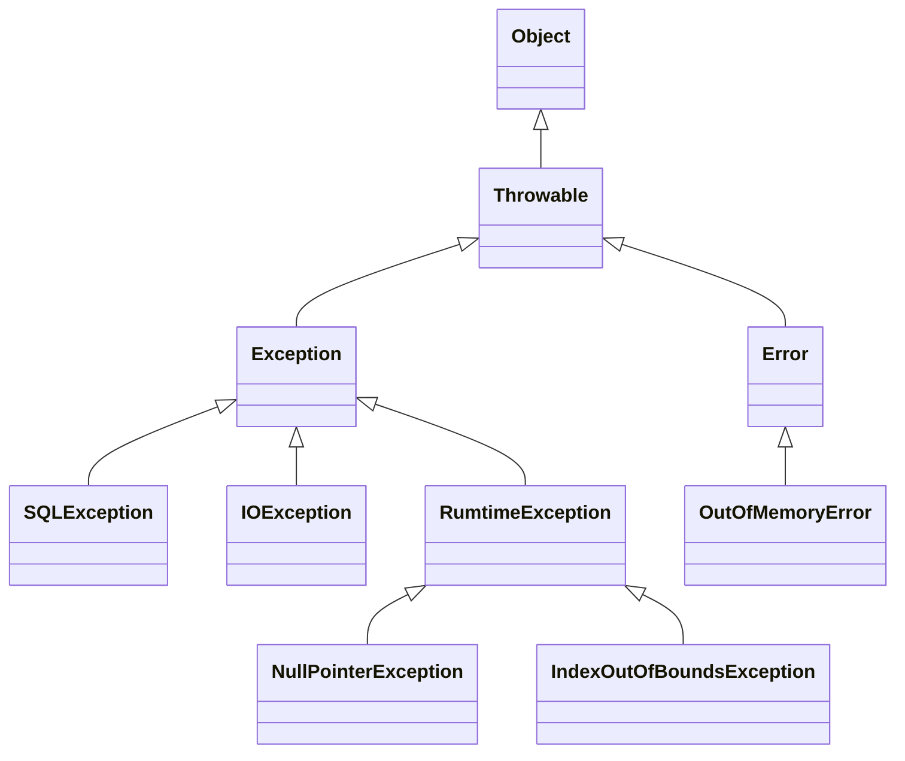

> Java에서 제공하는 예외처리 기능

# 예외: Exception
Java 에서는 개발자가 프로그램 로직 개발 간 발생할 수 있는 여러 오류 및 예외 사항에 대해 처리할 수 있도록 메소드에서 반환 값 뿐 아니라 예외를 던져줄 수 있다.
- 메소드에서 던져주는 `Exception`의 종류에 따라 특정 상황에서의 대처를 할 수 있도록 제공한다.
## Exception 객체 구조
Java에서 제공하는 예외 관련 객체는 아래와 같은 구조로 이루어져 있다.

위와 같이 `Throwable` 객체 하위 요소에 따라 크게 `Exception`과 `Error` 객체로 나뉘며 `Error`객체의 경우 프로세스 실행 간 발생할 수 있는 오류 시에 출력되며, 이러한 `Error` 객체는 프로그램 실행 중에는 별도로 해결할 수 없기에, 개발자는 `Error`에 대해서는 별도 처리를 하지 않는다.
- `Error`를 별도로 처리한다는 행위 자체가 오히려 에러 상황을 식별하기 어렵게 만들 수 있다.

`Exception` 객체의 경우, Java의 컴파일러가 해당 `Exception`들을 식별하기에 관련 `Exception`이 발생할 수 있는 메소드 호출 등의 경우 해당 `Exception`을 처리하지 않으면 컴파일 오류가 발생한다.
- 단, 하위 객체 중 `RuntimeError`를 포함한 하위 예외들은 컴파일러가 관련 처리 여부를 확인하지 않는다.

이 외에도 다양한 `Exception` 및 `Error` 하위 객체들이 존재한다.

> [!CAUTION]
> **상위 예외 객체 처리**
> 
> Java에서는 상위 객체는 하위 객체를 포함하고 있으며, 이는 예외 객체들도 마찬가지이다. 그렇기에 만약 `Throwable` 예외 객체에 대한 예외 처리 작업을 할 경우 `Throwable` 하위 전체, 즉 `Exception` 뿐 아니라 `Error` 객체 또한 처리하게 되는 경우가 발생할 수 있다.
> 
> 그렇기에 일반적인 예외 처리 과정은 최대 `Exception` 객체에 대한 처리 작업을 기준으로 한다.

## 예외 처리 규칙
Java에서는 예외 처리, 즉 `Exception`객체에 대한 처리를 아래의 키워드들을 사용하여 처리할 수 있다.
### throw / throws
`throw`는 특정 `Exception` 객체를 던지도록 하는 예약어이며, `throws`는 해당 메소드에서 발생할 수 있는 예외를 표현한 예약어이다.
```java
public class ExceptionThrower {  
    public String test(String input) throws Exception {  
        if (input == null) {  
            throw new Exception("input is null");  
        }  
  
        return "Successes";  
    }  
}
```
위와 같은 형태로 사용할 수 있으며, 위의 경우 메소드 내에 상황에 따라 `throw` 키워드를 통한 `Exception` 객체를 던지고 있으며, `Exception` 객체의 경우 컴파일 시점에 확인되는 `Exception` 객체이기에 메소드에 `throws` 키워드를 사용하여 이러한 `Exception` 객체가 던져질 수 있단 것을 명시한다.
- *`RuntimeException` 및 하위 객체들은 `throws`를 명시하지 않아도 됨*
### try-catch-finally
`throw` 및 `throws`를 통해 특정 메소드에서 던져지는 `Exception`들은 반드시 해당 메소드를 호출한 코드 블럭 내에서 처리되거나 상위 메소드에서 처리되야 한다.

Java에서는 위와 같이 메소드 호출 결과 반환된 `Exception`들을 처리할 수 있는 키워드들을 제공한다.
```java
public static void main(String[] args) throws Exception {  
    ExceptionThrower exceptionThrower = new ExceptionThrower();  
  
    try {  
        exceptionThrower.test("test");  
        exceptionThrower.test(null);  
    } catch (Exception e) {  
        System.out.println("Error : " + e);  
        throw e;  
    } finally {  
        System.out.println("Test Finished");  
    }  
}
```
위와 같이 호출한 메소드가 `throws` 키워드를 통해 특정 `Exception`이 발생할 수 있음을 명시하였으면, 해당 메소드를 호출하는 코드 블럭 내에서 해당 `Exception`을 처리하기 위해 해당 메소드를 `try` 키워드로 묶으며, `try` 키워드 내에서 발생한 `Exception` 들은 `catch` 키워드를 통해 식별하여 처리할 수 있다.

그외에 `Exception` 발생 여부에 관계 없이 `finally` 키워드를 사용하여 예외가 발생하더라도 이후 프로세스를 실행 하도록 할 수 있다.

> [!NOTE]
> **예외 전파**
> 
> Java에서 특정 메소드에서 예외가 발생할 경우, 해당 예외는 해당 메소드를 호출한 상위 메소드에서 처리하거나, 처리하지 못할 경우 그 상위 메소드로 전파되게 된다.
> 
> 이 때, 최종적으로 main 메소드에 까지 전파될 경우 해당 프로그램은 예외 로그를 출력 후 종료되게 된다.

> [!NOTE]
> **Checked Exception 과 Unchecked Exception**
> 
> Java에서는 `throws` 키워드를 통해 예외 객체를 상위로 던지는 요소들을 명시적으로 표기하여 컴파일 시점에 잡느냐, 잡지 않느냐에 따라 크게 `Checked Exception`과 `Unchecked Exception`으로 구분된다.
> 
> `Checked Exception`의 경우, `Exception` 객체를 상속 받는 하위 예외 객체들을 뜻하며, 이러한 예외 객체들은 `try-catch` 키워드를 통해 예외 처리를 하거나 `throws`를 통해 예외를 상위로 던져주는 것을 명시해야 한다. 만약, 명시하지 않을 경우 컴파일 시점에 관련 오류가 발생한다.
> 
> 이와 다르게 `Unchecked Exception`은 `RuntimeException` 객체를 상속 받는 하위 예외 객체들을 뜻하며, 컴파일 시점에 별도의 예외 처리를 명시하지 않아도 문제가 발생하지 않는다.
> 
> 각각의 상황에 따라 명시적으로 전달되는 `Checked Exception`을 통해 보다 명확한 사용자 인터페이스를 제공하거나, `Unchecked Exception`을 통해 별도의 자잘한 예외 처리를 무시할 수 있다.