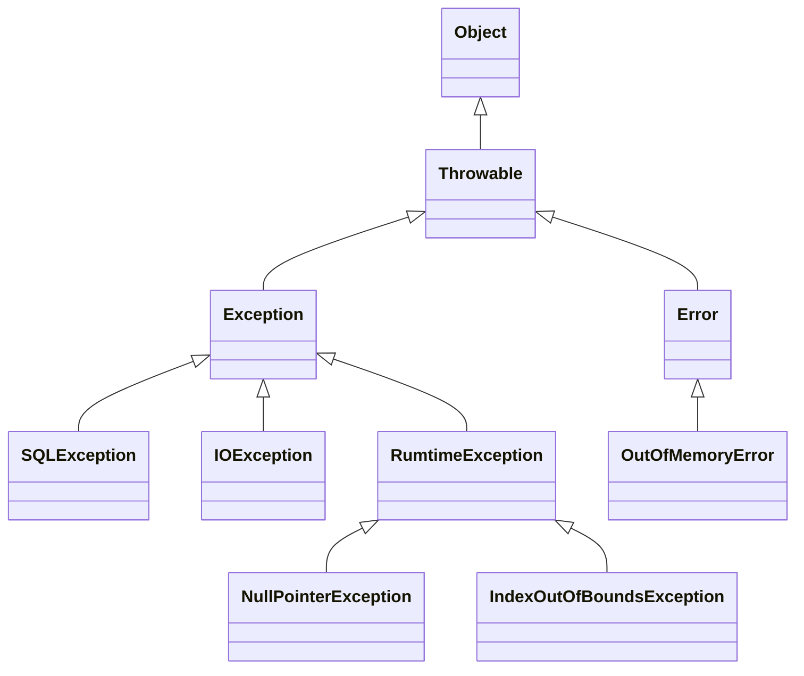
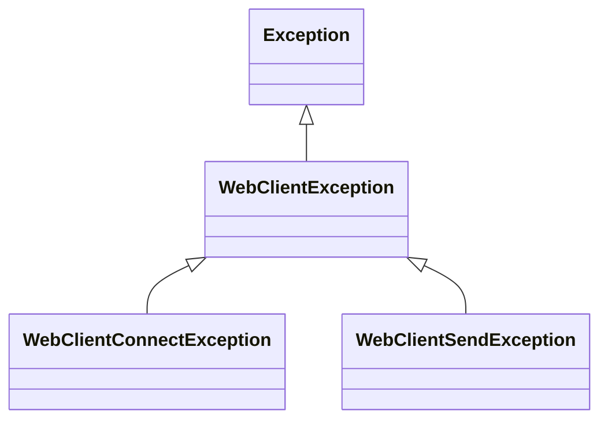
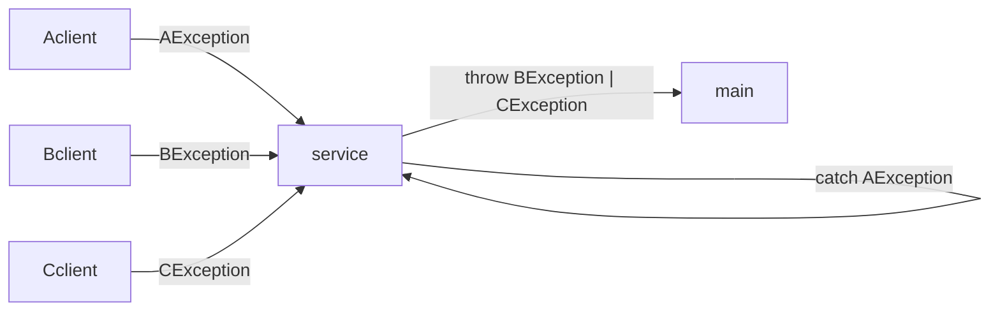
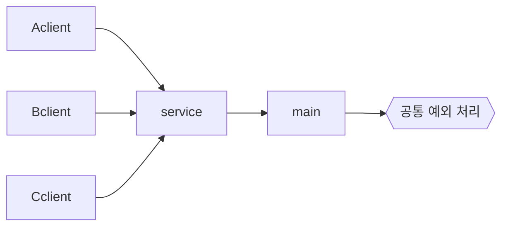

> Java에서 제공하는 예외처리 기능

# 예외: Exception
Java 에서는 개발자가 프로그램 로직 개발 간 발생할 수 있는 여러 오류 및 예외 사항에 대해 처리할 수 있도록 메소드에서 반환 값 뿐 아니라 예외를 던져줄 수 있다.
- 메소드에서 던져주는 `Exception`의 종류에 따라 특정 상황에서의 대처를 할 수 있도록 제공한다.
## Exception 객체 구조
Java에서 제공하는 예외 관련 객체는 아래와 같은 구조로 이루어져 있다.

위와 같이 `Throwable` 객체 하위 요소에 따라 크게 `Exception`과 `Error` 객체로 나뉘며 `Error`객체의 경우 프로세스 실행 간 발생할 수 있는 오류 시에 출력되며, 이러한 `Error` 객체는 프로그램 실행 중에는 별도로 해결할 수 없기에, 개발자는 `Error`에 대해서는 별도 처리를 하지 않는다.
- `Error`를 별도로 처리한다는 행위 자체가 오히려 에러 상황을 식별하기 어렵게 만들 수 있다.

`Exception` 객체의 경우, Java의 컴파일러가 해당 `Exception`들을 식별하기에 관련 `Exception`이 발생할 수 있는 메소드 호출 등의 경우 해당 `Exception`을 처리하지 않으면 컴파일 오류가 발생한다.
- 단, 하위 객체 중 `RuntimeError`를 포함한 하위 예외들은 컴파일러가 관련 처리 여부를 확인하지 않는다.

이 외에도 다양한 `Exception` 및 `Error` 하위 객체들이 존재한다.

> [!CAUTION]
> **상위 예외 객체 처리**
> 
> Java에서는 상위 객체는 하위 객체를 포함하고 있으며, 이는 예외 객체들도 마찬가지이다. 그렇기에 만약 `Throwable` 예외 객체에 대한 예외 처리 작업을 할 경우 `Throwable` 하위 전체, 즉 `Exception` 뿐 아니라 `Error` 객체 또한 처리하게 되는 경우가 발생할 수 있다.
> 
> 그렇기에 일반적인 예외 처리 과정은 최대 `Exception` 객체에 대한 처리 작업을 기준으로 한다.

## 예외 처리 규칙
Java에서는 예외 처리, 즉 `Exception`객체에 대한 처리를 아래의 키워드들을 사용하여 처리할 수 있다.
### throw / throws
`throw`는 특정 `Exception` 객체를 던지도록 하는 예약어이며, `throws`는 해당 메소드에서 발생할 수 있는 예외를 표현한 예약어이다.
```java
public class ExceptionThrower {  
    public String test(String input) throws Exception {  
        if (input == null) {  
            throw new Exception("input is null");  
        }  
  
        return "Successes";  
    }  
}
```
위와 같은 형태로 사용할 수 있으며, 위의 경우 메소드 내에 상황에 따라 `throw` 키워드를 통한 `Exception` 객체를 던지고 있으며, `Exception` 객체의 경우 컴파일 시점에 확인되는 `Exception` 객체이기에 메소드에 `throws` 키워드를 사용하여 이러한 `Exception` 객체가 던져질 수 있단 것을 명시한다.
- *`RuntimeException` 및 하위 객체들은 `throws`를 명시하지 않아도 됨*
### try-catch-finally
`throw` 및 `throws`를 통해 특정 메소드에서 던져지는 `Exception`들은 반드시 해당 메소드를 호출한 코드 블럭 내에서 처리되거나 상위 메소드에서 처리되야 한다.

Java에서는 위와 같이 메소드 호출 결과 반환된 `Exception`들을 처리할 수 있는 키워드들을 제공한다.
```java
public static void main(String[] args) throws Exception {  
    ExceptionThrower exceptionThrower = new ExceptionThrower();  
  
    try {  
        exceptionThrower.test("test");  
        exceptionThrower.test(null);  
    } catch (Exception e) {  
        System.out.println("Error : " + e);  
        throw e;  
    } finally {  
        System.out.println("Test Finished");  
    }  
}
```
위와 같이 호출한 메소드가 `throws` 키워드를 통해 특정 `Exception`이 발생할 수 있음을 명시하였으면, 해당 메소드를 호출하는 코드 블럭 내에서 해당 `Exception`을 처리하기 위해 해당 메소드를 `try` 키워드로 묶으며, `try` 키워드 내에서 발생한 `Exception` 들은 `catch` 키워드를 통해 식별하여 처리할 수 있다.

그외에 `Exception` 발생 여부에 관계 없이 `finally` 키워드를 사용하여 예외가 발생하더라도 이후 프로세스를 실행 하도록 할 수 있다.

> [!NOTE]
> **예외 전파**
> 
> Java에서 특정 메소드에서 예외가 발생할 경우, 해당 예외는 해당 메소드를 호출한 상위 메소드에서 처리하거나, 처리하지 못할 경우 그 상위 메소드로 전파되게 된다.
> 
> 이 때, 최종적으로 main 메소드에 까지 전파될 경우 해당 프로그램은 예외 로그를 출력 후 종료되게 된다.

> [!NOTE]
> **Checked Exception 과 Unchecked Exception**
> 
> Java에서는 `throws` 키워드를 통해 예외 객체를 상위로 던지는 요소들을 명시적으로 표기하여 컴파일 시점에 잡느냐, 잡지 않느냐에 따라 크게 `Checked Exception`과 `Unchecked Exception`으로 구분된다.
> 
> `Checked Exception`의 경우, `Exception` 객체를 상속 받는 하위 예외 객체들을 뜻하며, 이러한 예외 객체들은 `try-catch` 키워드를 통해 예외 처리를 하거나 `throws`를 통해 예외를 상위로 던져주는 것을 명시해야 한다. 만약, 명시하지 않을 경우 컴파일 시점에 관련 오류가 발생한다.
> 
> 이와 다르게 `Unchecked Exception`은 `RuntimeException` 객체를 상속 받는 하위 예외 객체들을 뜻하며, 컴파일 시점에 별도의 예외 처리를 명시하지 않아도 문제가 발생하지 않는다.
> 
> 각각의 상황에 따라 명시적으로 전달되는 `Checked Exception`을 통해 보다 명확한 사용자 인터페이스를 제공하거나, `Unchecked Exception`을 통해 별도의 자잘한 예외 처리를 무시할 수 있다.

> [!NOTE]
> 
> **finally 활용**
> 
> Java에서 예외 처리 관련 제공 키워드인 `finally`는 `try`문이 실행된 이후에는 무조건적으로 내`finally`문 내부 코드 블럭을 실행하도록 보장한다. 이를 통해 예외가 발생하더라도 `try`문에서 할당된 자원을 해제하거나, 필수적으로 진행해야되는 프로세스를 진행할 수 있도록 지원한다.
> 
> 뿐만 아니라, `catch`문을 통해 잡히는 예외 뿐만 아니라 handling 하지 않은 예외 및 `Unchecked Exception`이 발생하더라도 이후 `finally` 내부 코드 블럭이 실행되게 된다.

# 예외 계층
Java에서 제공하는 예외들은 전부 `Exception` 객체의 하위 객체들을 뜻하며, 이에 따라 사용자가 직접 구현한 예외들의 경우에도 `Exception`의 하위 객체들이다.

즉, 예외 객체들은 객체와 동일한 특징을 지니고 있으며, 예를 들어 아래와 같은 계층 구조를 구성할 경우, 상위 계층의 `Exception`를 `catch` 시 하위 계층의 `Exception`들도 함께 예외처리 할 수 있게 된다.



```java
public class WebClientException extends Exception {  
    public WebClientException(String message) {  
        super(message);  
    }  
}
...
public class WebClientConnectException extends WebClientException {  
    private final String address;  
  
    public WebClientConnectException(String address) {  
        super(String.format("%s 서버 연결에 실패하였습니다.", address));  
        this.address = address;  
    }
}
...
public class WebClientSendException extends WebClientException {  
    private final String sendData;  
  
    public WebClientSendException(String sendData) {  
        super(String.format("데이터 전송에 실패하였습니다. data: {%s}", sendData));  
        this.sendData = sendData;  
    }
}
...
public class WebClient {  
	...
    public void connect() throws WebClientConnectException {  
        ...
    }  
  
    public void send(String message) throws WebClientSendException {  
        ...
    }
    ...
}
...
public class WebService {  
    private final WebClient webClient;  
  
    public WebService(String remoteServerUrl) {  
        this.webClient = new WebClient(remoteServerUrl);  
    }  
  
    public void sendData(String data) {  
        webClient.initError(data);  
  
        try {  
            webClient.connect();  
            webClient.send(data);  
        } catch (WebClientConnectException e) {  
            System.out.println("[연결 오류] " + e.getMessage());  
        } catch (WebClientSendException e) {  
            System.out.println("[전송 오류] " + e.getMessage());  
        } catch (Exception e) {  
            System.out.println("[알 수 없는 오류] " + e.getMessage());  
        } finally {  
            webClient.disconnect();  
        }  
    }  
}
```

위와 같이 각 예외 상황들을 계층 별로 구성하여 사용함으로써 보다 명확한 예외 상황 및 그에 따른 대처 및 처리가 용이해진다.

## 예외 계층 처리 순서
아래와 같이 여러 계층의 예외 객체들을 처리할 경우, 순서를 주의하여야 한다.
```java
...
		try {  
            webClient.connect();  
            webClient.send(data);  
        } catch (WebClientConnectException e) {  
            System.out.println("[연결 오류] " + e.getMessage());  
        } catch (WebClientSendException e) {  
            System.out.println("[전송 오류] " + e.getMessage());  
        } catch (Exception e) {  
            System.out.println("[알 수 없는 오류] " + e.getMessage());  
        } finally {  
            webClient.disconnect();  
        }
```

위의 경우 `WebClientException`의 하위 객체들인 `WebClientConnectException`과 `WebClientSendException`을 먼저 처리하며, 이후 `Exception`을 처리하는 구조로 작성되어 있다.

Java에서는 계층을 이루고 있는 예외 객체들 간의 예외 처리 시 하위 예외들부터 `catch`키워드를 사용하도록 강제한다.

```java
try {  
    webClient.connect();  
    webClient.send(data);  
  
} catch (Exception e) {  // 컴파일 오류 발생!
    System.out.println("[알 수 없는 오류] " + e.getMessage());  
} catch (WebClientConnectException e) {  
    System.out.println("[연결 오류] " + e.getMessage());  
} catch (WebClientSendException e) {  
    System.out.println("[전송 오류] " + e.getMessage());  
} finally {  
    webClient.disconnect();  
}
```

만약 위와 같이 `Exception` 객체에 대한 처리를 제일 먼저 할 경우, 이후 하위 예외 객체들은 위에서 이미 처리되었기에 처리되지 못하는 문제가 발생하기에, 컴파일 시점에서부터 오류를 출력하여 상위 예외 객체와 하위 예외 객체가 있을 경우 하위 예외 객체부터 처리하도록 유도한다.

# 실무에서의 예외처리 방식
Java에서 예외는 크게 `Checked Exception`과 `Unchecked Exception`으로 구분된다.

`Checked Exception`은 컴파일 시점에 예외를 처리하거나 던지는것을 명시하여야 하기에 언뜻 보기에는 `Checkd Exception`을 주로 활용하여 실무에서 예외 처리 과정을 구성할 듯 하나, 실제로는 아래의 요소들로 인해 컴파일 시점에 예외처리를 묵시적으로 던지도록 하는 `Unchecked Exception`이 보다 실용적이므로 많이 쓰인다
## Checked Exception의 단점
현대에 이르러서는 다양한 Java 라이브러리들을 활용하거나 외부 서버와의 연결 및 통신 등을 통해 비즈니스 로직을 처리하는 경우가 많아졌다.



이에 따라 외부 라이브러리나 서버에서 `Checked Exception`을 던져서 예외 처리를 명시하게 하더라도, 실질적인 원인이 외부에 있기에 근본적으로 해결하기 어렵다.

이에 따라 결국 `throw` 키워드를 통해 해당 예외들을 던지게 되며, 이는 결국 `Unchecked Exception`이 묵시적으로 던지는 것과 다를 바 없게 되며, 오히려 명시적으로 선언해야 되기에 외부에서 오는 예외들이 많아질수록 코드량만 증가하게 된다.

## 예외에 대한 공통 처리
`Unchecked Exception`을 주로 활용할 경우, 예외 처리에 대해 명시할 필요가 없으며, 별도 처리하지 않을 경우 바깥으로 던지게 된다. 

이에 따라 실질적으로는 가장 바깥 지점까지 던져지게 되며, 다양한 상황에서 발생한 `Unchecked Exception`들을 가장 바깥에서 공통적으로 처리하도록 하면, 예외들이 증가하더라도 문제 요소를 줄일 수 있다.



- *웹/앱 등의 경우 사용자에겐 단순 에러 메시지를 출력하며, 관련 에러들에 대한 로그를 서버에기록 하거나 별도 알림을 개발자에게 전달하는 등의 작업으로 공통 처리한다*

# try-with-resources
Java에서 외부 자원 객체에 대해서는 사용 후 즉각적으로, 연결을 해제 해주어야 다른 요소들이 해당 외부 자원 객체에 접근하거나 별도의 `Side Effect`의 발생을 최소화 할 수 있다.

```java
public static void main(String[] args) {  
    Scanner scanner = new Scanner(System.in);  
  
    try {  
        String str = scanner.next();  
    } catch (Exception e) {  
        e.printStackTrace(System.out);  
    } finally {  
        scanner.close();  // 자원 해제 필요
    }  
}
```

그렇기에 위와 같은 외부 자원 접근 객체 사용 시에는 `close()` 메소드와 같이 자원 연결을 해제를 필수로 진행하여야 하며, `try` 키워드 사용 시에도 동일한 작업을 위해 예외 발생 여부에 관계 없이 실행되도록 `finally` 블럭 내에 위치하도록 구성해왔다.

Java에서는 이러한 요소들의 편의성 제공을 위해 Java 7부터 `try`문 내에서 외부 자원 접근 객체 사용 시 아래와 같이 `try` 키워드를 사용할 경우 `try` 블럭을 벗어나면 곧바로 자원 연결을 해제되도록 `try-with-resources` 방식을 지원하게 되었다.

```java
public static void main(String[] args) {  
  
    try (Scanner scanner = new Scanner(System.in)) {  
        String str = scanner.next();  
    } catch (Exception e) {  
        e.printStackTrace(System.out);  
    }  
}
```

이를 통해 기존 `finally`에서 명시적으로 자원 해제를 할 필요가 없어지며, `finally` 블럭 내에서 호출할 때보다 빠르게 자원을 해제할 수 있다.
- `finally`에서 처리할 경우 `catch`등의 예외 처리 이후에 처리되지만, `try-with-resources` 방식은 `try`문을 벗어나자마자 처리됨
## AutoClosable 인터페이스
`try-with-resources` 방식을 통해 `try`문을 벗어날 때 자동으로 자원 해제가 되는 객체들은 Java에서 제공하는 `AutoClosable` 인터페이스에 대한 구현체로 구성되어 있어야 한다.

```java
public interface AutoCloseable {
	void close() throws Exception;
}
```

위와 같은 형태의 인터페이스 객체로써 Java에서는 해당 인터페이스에 대한 구현체 객체에 한해서만 `try-with-resources` 기능을 지원한다.
- Java 에서 기본적으로 제공하는 Scanner, Reader 등과 같은 외부 자원 접근 객체들은 내부적으로 `AutoClosable` 인터페이스 구현체를 상속 받고 있음