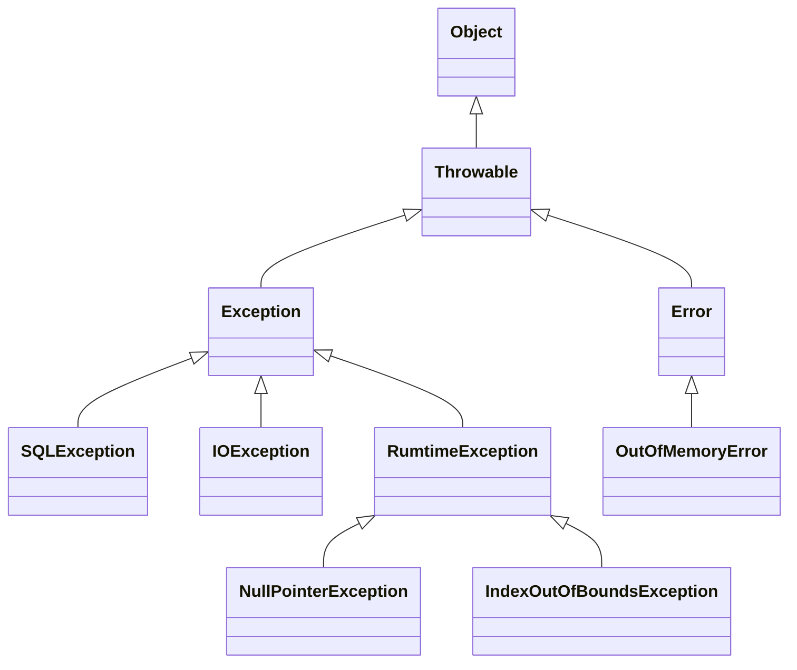

> Java에서 제공하는 예외처리 기능

# 예외: Exception
Java 에서는 개발자가 프로그램 로직 개발 간 발생할 수 있는 여러 오류 및 예외 사항에 대해 처리할 수 있도록 메소드에서 반환 값 뿐 아니라 예외를 던져줄 수 있다.
- 메소드에서 던져주는 `Exception`의 종류에 따라 특정 상황에서의 대처를 할 수 있도록 제공한다.
## Exception 객체 구조
Java에서 제공하는 예외 관련 객체는 아래와 같은 구조로 이루어져 있다.

위와 같이 `Throwable` 객체 하위 요소에 따라 크게 `Exception`과 `Error` 객체로 나뉘며 `Error`객체의 경우 프로세스 실행 간 발생할 수 있는 오류 시에 출력되며, 이러한 `Error` 객체는 프로그램 실행 중에는 별도로 해결할 수 없기에, 개발자는 `Error`에 대해서는 별도 처리를 하지 않는다.
- `Error`를 별도로 처리한다는 행위 자체가 오히려 에러 상황을 식별하기 어렵게 만들 수 있다.

`Exception` 객체의 경우, Java의 컴파일러가 해당 `Exception`들을 식별하기에 관련 `Exception`이 발생할 수 있는 메소드 호출 등의 경우 해당 `Exception`을 처리하지 않으면 컴파일 오류가 발생한다.
- 단, 하위 객체 중 `RuntimeError`를 포함한 하위 예외들은 컴파일러가 관련 처리 여부를 확인하지 않는다.

이 외에도 다양한 `Exception` 및 `Error` 하위 객체들이 존재한다.

> [!CAUTION]
> **상위 예외 객체 처리**
> 
> Java에서는 상위 객체는 하위 객체를 포함하고 있으며, 이는 예외 객체들도 마찬가지이다. 그렇기에 만약 `Throwable` 예외 객체에 대한 예외 처리 작업을 할 경우 `Throwable` 하위 전체, 즉 `Exception` 뿐 아니라 `Error` 객체 또한 처리하게 되는 경우가 발생할 수 있다.
> 
> 그렇기에 일반적인 예외 처리 과정은 최대 `Exception` 객체에 대한 처리 작업을 기준으로 한다.