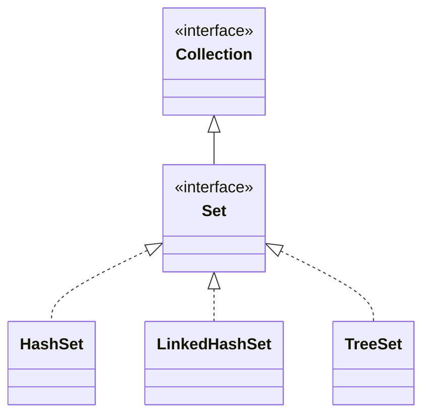

> Java의 Set 자료구조에 대한 최상위 인터페이스

# Set이란?
다양한 데이터에 대한 처리 기법을 다루는 자료 구조에서 중복 데이터를 허용하지 않는 대신, 순서 또한 보장하지 않는 형태의 자료 구조를 **Set** 자료 구조라고 하며, Java에서는 `Collection Framework`에서 관련 최상위 인터페이스를 제공하며, 하위로 `HashSet`, `LinkedHashSet` 및 `TreeSet`등의 구현체를 제공한다.

```java
Set<Integer> set1 = new HashSet<>();
Set<Integer> set2 = new LinkedHashSet<>();
Set<Integer> set3 = new TreeSet();
```

## Set의 추상화
`List` 인터페이스와 마찬가지로 Java에서 제공하는 자료구조들은 일반적으로 인터페이스 형태의 최상단 객체를 제공하며, 해당 인터페이스에는 해당 자료구조에서 제공해야할 필수 기능들이 포함되어 있다.
```java
public interface Set<E> {
	...
	boolean contains(Object o);
	boolean add(E e);
	...
}
```

`Set`의 경우 `Set` 자료구조에서 기본적으로 제공해야할 데이터 적재 및 조회 등에 대해 최상위 인터페이스에서 명시하고 있으며, Java에서는 해당 인터페이스를 기반으로 `Set` 자료구조에 대한 여러 구현체들을 구성하여 제공하고 있다.

## Set 인터페이스 관계
Java에서는 `Set` 자료구조를 제공하는 `HashSet`, `LinkedHashSet` 및 `TreeSet` 등의 구현체가 존재하며 이들은 아래와 같이 `Set` 인터페이스와 관계를 구성하고 있다.


Java에서는 대략 위와 같은 형태로 구현 되어 있으나, 정확하지는 않으며 각 구현체와 인터페이스 사이에는 `HashMap`, `AbstractSet` 등 중간 구현체들도 존재한다.