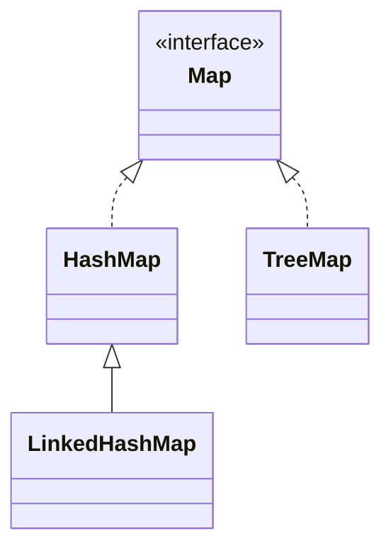

> Java에서 제공하는 Map 형태의 자료구조에 대한 최상위 인터페이스

# Map
**Map**이란 Key-Value 구조로 데이터를 관리하는 자료구조의 형태로, 주로 중복을 허용하지 않는 `Key`값을 통해 데이터를 조회하며, 이러한 데이터들은 `Key` 마다 매핑 되어 있는 `Value`의 형태로 저장된다.
이 때, `Key`와 다르게 `Value`는 중복을 허용하며, `Key-Value` 모두 입력 순서를 보장하지 않는다.

## Map 인터페이스 관계
Java에서는 이러한 **Map** 형태의 자료구조를 아래와 같은 구조로 제공하고 있다.


기존 **List**와 **Set** 과는 다르게 단일 데이터에 대한 관리 객체가 아닌, `Key-Value` 두 쌍에 대한 데이터를 관리하기에 `Collection` 인터페이스의 하위 인터페이스가 아닌 별개의 인터페이스로 구성되어 있으며, `HashMap`, `TreeMap` 등의 구현체를 제공하고 있다.

## 주요 메소드
`Map` 인터페이스에서는 기본적으로 `Key-Value` 쌍을 기준으로 한 데이터 삽입, `Key` 를 기반으로 한 데이터 조회 및 `Key-Value` 쌍 조회 등의 기능들을 정의하고 있다.
### 데이터 삽입
`Map` 인터페이스 객체 내 데이터 삽입은 주로 아래와 같은 메소드를 통해 이루어 진다.
```java
Map<String, Integer> map = new HashMap<>();  
  
map.put("a", 1);  
map.put("b", 2);  
map.putIfAbsent("b", 3);
```
#### put(K key, V value)
기본적인 데이터 주입 기능으로 주어진 `Key` 와 `Value` 쌍을 저장한다.

#### putIfAbsent(K key, V value)
`put()`과 동일하게 데이터를 주입하는 기능을 제공하나 주어진 `Key`가 이미 존재할 경우 해당 `Key`에 매핑된 `Value`를 반환하고, 그렇지 않을 경우 주어진 `Value` 를 주입한다.
### 데이터 조회
`Map` 인터페이스 객체 내 데이터 검색 및 조회는 주로 아래와 같은 메소드를 통해 이루어 진다.
```java
...  
map.get("a");  
map.get("b");  
map.getOrDefault("c", 0);  
map.containsKey("c");  
map.containsValue(50);
```
#### get(K key)
주어진 `Key`가 저장 되어 있을 경우, `Key`에 매핑된 `Value`를 반환한다.
#### getOrDefault(K key, V value)
`get()` 과 비슷하나, `Key`를 찾을 수 없을 경우, 인자로 주어진 `Value`를 반환한다.
#### containsKey(K key) / containsValue(V value)
각각 현재 `Map`에 `Key`가 저장되어 있는지, `Value`가 저장되어 있는지 여부를 반환한다.