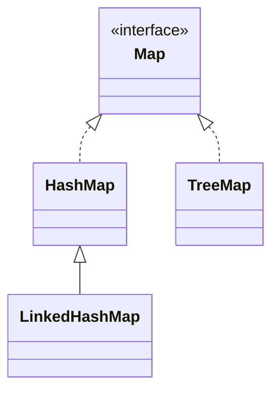

> Java에서 제공하는 Map 형태의 자료구조에 대한 최상위 인터페이스

# Map
**Map**이란 Key-Value 구조로 데이터를 관리하는 자료구조의 형태로, 주로 중복을 허용하지 않는 `Key`값을 통해 데이터를 조회하며, 이러한 데이터들은 `Key` 마다 매핑 되어 있는 `Value`의 형태로 저장된다.
이 때, `Key`와 다르게 `Value`는 중복을 허용하며, `Key-Value` 모두 입력 순서를 보장하지 않는다.

## Map 인터페이스 관계
Java에서는 이러한 **Map** 형태의 자료구조를 아래와 같은 구조로 제공하고 있다.


기존 **List**와 **Set** 과는 다르게 단일 데이터에 대한 관리 객체가 아닌, `Key-Value` 두 쌍에 대한 데이터를 관리하기에 `Collection` 인터페이스의 하위 인터페이스가 아닌 별개의 인터페이스로 구성되어 있으며, `HashMap`, `TreeMap` 등의 구현체를 제공하고 있다.
### HashMap
Java에서 제공하는 `Map` 구현체 중 하나로, 입력되는 `Key` 값들을 `Hash Index`로 활용하여 데이터를 관리하며, 이에 따라 `Key` 값을 기준으로 한 데이터 검색 시 높은 성능을 기대할 수 있다.
### LinkedHashMap
Java에서 제공하는 `Map` 구현체 중 하나로, 기본적인 사항들은 `HashMap`과 동일하나, 입력된 각 `Key-Value` 쌍을 순서대로 연결하여 관리함으로써 입력 순서를 보장한다.

### TreeMap
Java에서 제공하는 Map 구현체 중 하나로, 기본적인 사항들은 `HashMap`과 동일하나 `Tree`자료구조 형태로 `Key-Value` 쌍을 관리하기에 `Key`값을 기준으로 한 논리적 순서를 기준으로 데이터를 적재한다.

> [!NOTE]
> **Map과 Set**
> 
> `Map`에서 제공하는 `HashMap`, `LinkedHashMap`, `TreeMap` 구현체들과 `Set`에서 제공하는 `HashSet`, `LinkedHashSet`, `TreeSet`은 이름에서 알 수 있듯이 서로 밀접하게 관계되어 있다.
> 
> 각각의 구현체들이 제공하는 기능들이나 특징들이 동일하며, 이는 `Map` 자료구조에서 `Value`를 제외하고 볼 경우 `Set`과 동일한 기능 및 특징들을 지니고 있기 때문이다.
> 
> 그렇기에 실제 Java의 `Set` 구현체들은 내부적으로 `Map` 구현체에 의존하고 있다.

## 주요 메소드
`Map` 인터페이스에서는 기본적으로 `Key-Value` 쌍을 기준으로 한 데이터 삽입, `Key` 를 기반으로 한 데이터 조회 및 `Key-Value` 쌍 조회 등의 기능들을 정의하고 있다.
### 데이터 삽입
`Map` 인터페이스 객체 내 데이터 삽입은 주로 아래와 같은 메소드를 통해 이루어 진다.
```java
Map<String, Integer> map = new HashMap<>();  
  
map.put("a", 1);  
map.put("b", 2);  
map.putIfAbsent("b", 3);
```
#### put(K key, V value)
기본적인 데이터 주입 기능으로 주어진 `Key` 와 `Value` 쌍을 저장한다.

#### putIfAbsent(K key, V value)
`put()`과 동일하게 데이터를 주입하는 기능을 제공하나 주어진 `Key`가 이미 존재할 경우 해당 `Key`에 매핑된 `Value`를 반환하고, 그렇지 않을 경우 주어진 `Value` 를 주입한다.
### 데이터 조회
`Map` 인터페이스 객체 내 데이터 검색 및 조회는 주로 아래와 같은 메소드를 통해 이루어 진다.
```java
...  
map.get("a");  
map.get("b");  
map.getOrDefault("c", 0);  
map.containsKey("c");  
map.containsValue(50);
```
#### get(K key)
주어진 `Key`가 저장 되어 있을 경우, `Key`에 매핑된 `Value`를 반환한다.
#### getOrDefault(K key, V value)
`get()` 과 비슷하나, `Key`를 찾을 수 없을 경우, 인자로 주어진 `Value`를 반환한다.
#### containsKey(K key) / containsValue(V value)
각각 현재 `Map`에 `Key`가 저장되어 있는지, `Value`가 저장되어 있는지 여부를 반환한다.
- 단 `containsKey()`의 경우 `Key`값이 `HashIndex`로 활용되기에 `O(1)`의 성능을 발휘하지만, `containsValue()`의 경우 실제 저장된 `Value`들을 전부 확인해야 하기에 최대 `O(n)`의 성능 저하가 발생한다.

### 데이터 집합 조회
`Map` 의 경우 `List`와 `Set`과 달리 `Key-Value` 두 쌍의 데이터를 관리하므로, 각 관리 데이터들에 대한 별도 데이터 집합을 조회하는 기능을 정의하고 있다.
#### keySet()
```java
Map<String, Integer> map = new HashMap<>();
map.put("a", 1);  
map.put("b", 2);
Set<String> keySet = map.keySet(); // ["a", "b"]
```
`Map`에서 제공하는 `keySet()` 메소드는 `Map`에서 관리하는 `Key`들을 모아 `Set` 형태로 반환하는 기능을 제공한다.
- *`Map`에서 `Key`의 경우 순서를 보장하지 않으며, 중복을 허용하지 않기에 `Set` 형태와 동일하게 반환할 수 있음*

#### values()
```java
Map<String, Integer> map = new HashMap<>();
map.put("a", 1);  
map.put("b", 2);
Collection<Integer> values = map.values(); // [1, 2]
```
앞서 `keySet()`과 반대로 `Map`에서 관리하는 `Value`들에 대한 데이터 집합을 반환하는 기능을 제공한다.

이 때, `Map`에 저장되는 `Value`들의 경우, 순서를 보장하지는 않으나 중복을 허용하기에 `List` 나 `Set`과는 일치하는 형태가 아니기에 상위 객체인 `Collection` 인터페이스 형태로 데이터 집합을 반환한다.

#### entrySet()
```java
Map<String, Integer> map = new HashMap<>();
map.put("a", 1);  
map.put("b", 2);
Set<Map.Entry<String, Integer>> entries = map.entrySet(); // [a=1, b=2]
```
`Map`에서는 `key-Value` 쌍으로 된 데이터 집합을 지니고 있기에, 내부적으로 각 `Key-Value`를 쌍으로 하는 `Entry`라는 형태의 객체들을 `Set` 형태로 반환 받을 수 있다.

> [!NOTE]
> **Map.Entry**
> 
> `Map` 인터페이스 내부에 정의된 인터페이스로 상위 인터페이스인 `Map`의 `Type Parameter`를 기반으로 하는 `Generic Class` 로 정의되어 있으며, 각각 `Key`와 `Value`를 반환할 수 있도록 메소드를 제공한다.
