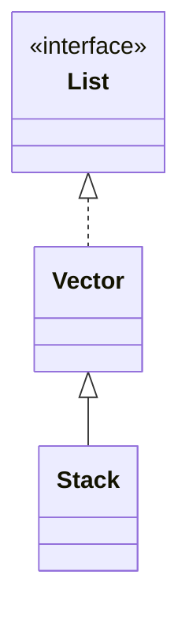

> Java에서 제공하는 Stack 자료구조 구현체

# Stack이란
데이터를 관리하는 자료구조 중 하나로써, 적재된 데이터들을 반환 할 때, 가장 최근에 적재된 데이터부터 반환하는 자료구조를 뜻한다.


이를 **LIFO(Last In First Out)** 혹은 **후입선출**이라고 하며 Java에서는 `Stack` 이라는 객체를 통해 **Stack** 자료구조를 사용할 수 있다.

## 주요 메소드
Java에서 제공하는 `Stack`은 크게 데이터 적재와 추출로 이루어져 있으며 아래와 같은 메소드들을 통해 지원한다.

### push(E e)
```java
Stack<Integer> stack = new Stack<>();  
stack.push(1); // [1]
stack.push(2); // [1, 2]
stack.push(3); // [1, 2, 3]
  
System.out.println(stack); // [1, 2, 3]
```
`push()` 메소드를 통해 `Stack`내 저장공간에 **타입 매개변수**로 지정된 타입의 데이터를 저장 할 수 있다.

### pop()
```java
...
// [1, 2, 3]
stack.pop(); // [1, 2] -> 3 
stack.pop(); // [1] -> 2
stack.pop(); // [] -> 1

```

`Stack`의 가장 큰 특징인 **LIFO** 방식의 데이터 추출 기능을 제공하며, 가장 마지막에 적재된 데이터를 반환한다.

## Stack의 객체 관계
Java에서 제공하는 `Stack` 의 경우 아래와 같은 객체 의존 관계를 지니고 있다.


`List` 인터페이스에 대한 구현체 중 하나인 `Vector` 객체를 상속 받아 구현되어 있으며, 이를 통해 데이터들을 적재 및 관리하고 있다.
- *`Vector` 객체의 경우 Java 1.0부터 존재해온 오래된 구현체 중 하나이다.*

> [!NOTE]
> **Vector의 한계**
> 
> 초기 Java 에서 구현된 `Vector` 객체의 경우, 현대에선 일부 비효율적이며, 다른 구현체들에 비해 성능이 낮기에 현재는 `Vector` 기반 객체들의 사용을 지양하고 있다. 그렇기에 `Vector` 의 하위 객체 중 하나인 `Stack` 또한 성능 상의 이슈 등으로 사용을 지양하고 있으며, Java에서는 보다 개선된 `Deque` 객체를 제안하고 있다.