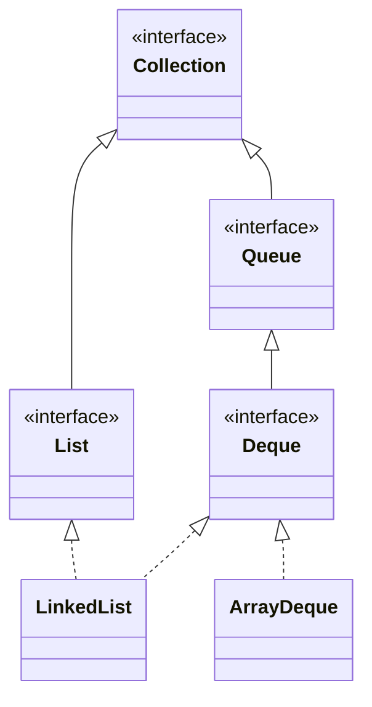

> Java에서 제공하는 Queue 자료구조에 대한 최상위 인터페이스

# Queue
자료구조 중 하나로써 적재된 데이터를 가장 처음에 적재 되었던 데이터 순대로 반환하는 자료구조로써, `Stack`과 반대로 **선입선출** 개념의 자료구조이다.


**FIFO (First In First Out)** 방식이라고도 하며 Java에서는 `Queue` 인터페이스를 통해 해당 자료구조에 대한 필요 기능을 정의하고 있다.


## 주요 메소드
Java에서 제공하는 `Queue` 인터페이스에서는 크게 데이터 적재 및 반환에 대한 기능을 담당하는 메소드들을 지원하고 있다.

### offer(E e)
```java
Queue<Integer> queue = new LinkedList<>();  
  
queue.offer(1); // [1]
queue.offer(2); // [1, 2]
queue.offer(3); // [1, 2, 3]
  
System.out.println(queue); // [1, 2, 3]
```
`offer()` 메소드를 통해 `Queue` 의 저장공간에 **타입 매개변수**에 해당하는 타입의 데이터를 적재할 수 있다.

### poll()
```java
...
// [1, 2, 3]
queue.poll(); // [2, 3] -> 1  
queue.poll(); // [3] -> 2
queue.poll(); // [] -> 3
```
`Queue`의 주요 특징인 **FIFO** 방식이 적용된 데이터 추출 메소드로, `Queue`에 저장된 데이터들 중 가장 처음에 저장된 데이터부터 반환한다.

# Deque
Java에서는 `Queue` 인터페이스의 하위 인터페이스로 `Deque` 인터페이스가 존재한다. `Deque`는 **Double Ended Queue**의 약자로 앙쪽에서 삽입 및 추출할 수 있는 자료구조를 뜻한다.


`Deque`의 경우 데이터 삽입 및 추출에 대해 양방향으로 지원하므로 `Stack` 자료구조와 `Queue`자료구조 모두를 지원할 수 있는 인터페이스이다.

## 주요 메소드
`Deque`는 각 방향에 따른 데이터 삽입 및 추출 등에 대해 각각에 메소드를 아래와 같이 지원한다.
### offerFirst(E e) / offerLast(E e)
```java
Deque<Integer> deque = new ArrayDeque<>();  
  
deque.offerFirst(1); // [1]  
deque.offerFirst(2); // [2, 1]  
deque.offerLast(3); // [2, 1, 3]  
deque.offerLast(4); // [2, 1, 3, 4]
```

`Deque`는 위와 같이 저장공간의 첫 번째로 데이터를 삽입하기 위한 `offerFirst()` 메소드와 저장 공간의 마지막에 데이터를 삽입하기 위한 `offerLast()` 메소드를 지원한다.

### pollFirst() / pollLast()
```java
// [2, 1, 4, 3]
deque.pollFirst(); // [1, 3, 4] -> 2  
deque.pollLast(); // [1, 3] -> 4
```

`Deque`는 **FIFO** 방식과 **LIFO** 방식 모두를 지원하는 특징이 있으며, 이에 따라 `Deque`의 저장 공간 내 첫 번째로 저장된 데이터를 추출하는 `pollFirst()`와 마지막에 저장된 데이터를 추출하는 `pollLast()` 메소드를 지원한다.

## Queue와 Deque 인터페이스 관계
Java에서 제공하는 `Queue`와 `Deque` 인터페이스는 아래와 같은 의존 관계로 구성되어 있다.

크게 위와 같은 의존 관계로 이루어져 있으며, `Queue`의 경우 **Collection Framework**의 최상위 인터페이스인 `Collection`을 상속 받고 있으며, `Deque`의 경우 그런 `Queue`를 상속 받고 있다.

또한 Java에서는 `Deque`에 대한 구현체로  `LinkedList`와 `ArrayDeque`를 제공하고 있으며, 이 중 `LinkedList`는 `List` 인터페이스와 `Deque` 인터페이스를 통해 구현되었다.

> [!NOTE]
> **LinkedList 와 ArrayDeque 차이**
> 
> Java에서 제공하는 `Deque` 인터페이스에 대한 구현체들로 `LinkedList`와 `ArrayDeque`가 존재한다. 해당 구현체들은 구현 방식에 따라 구별되며, `LinkedList`의 경우 `Node` 객체를 통한 데이터 간의 참조 객체 연결 구성을 통해 저장된 데이터를 관리하고 있으며, `ArrayDeque`의 경우 배열을 통해 데이터를 관리하고 있다.
> 
> 각 데이터 관리 방식에 따라 성능의 차이가 발생하는데, 둘 모두 이론 상 데이터 조회 및 삭제 등에 `O(1)`의 성능을 보이나 배열과 `Node`라는 특성 상, 메모리 상에 적재된 방식에 따른 차이로 `ArrayDeque` 가 상대적으로 성능이 더 높다.
> - *배열은 연속된 메모리 영역에 데이터가 저장되는데 반해, `Node`는 각각 임의의 메모리 영역에 할당되기 때문임*

> [!NOTE]
> **Deque에서 제공하는 Stack 메소드**
> 
> Java의 기존 `Stack` 은 `Vector`라는 객체를 상속 받아 구현되어 있으며, 이는 초기 버전에서 구현된 요소임에 따라 일부 성능 상 단점이 존재한다. 이에 따라 Java에서는 `Deque`로 대신 사용하는 것을 지향하고 있으며, `Deque`의 기능이 `Stack`의 기능을 포함하고 있기에 내부적으로 `Stack`에서 쓰이는 `push()`와 `pop()` 메소드를 기본적으로 제공한다.
> 
> 또한 `Deque`자체가 `Queue`의 하위 인터페이스이기에 `Queue`에서 제공하는 `offer()`, `poll()` 메소드 또한 지원한다.