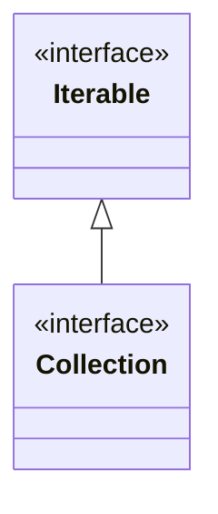

> Java의 Collection 객체들의 순회 기능을 담당하는 인터페이스

# Collection 객체의 순회
Java에는 `List`, `Set`, `Tree` 등 다양한 형태의 **Collection** 자료구조를 인터페이스를 지원하고 있다.

이러한 객체들은 또한, 내부 구현 방식에 따라 `ArrayList`, `LinkedList` 등 다양한 구현체로 이루져 있으며, 이에 따라 각 구현체들의 동작방식은 매우 다양하게 구현되어 있다.

이 때, Java에서는 각 **Collection** 구현체들의 구현 방식에 관계 없이 내부 데이터를 순회할 수 있도록 공통된 기능을 제공하는 `Iterable`과 `Iterator` 인터페이스를 제공하고 있다.

이에 따라, `Iterable`과 `Iterator`에 대한 인터페이스를 포함하고 있는 **Collection** 객체들은 사용자가 내부 동작 방식을 모르더라도 공통적으로 제공하는 메소드를 통해 데이터 순회 작업을 진행 할 수 있다.

## Iterable과  Iterator
Java에서 제공하는 데이터 순회 기능은 각각 데이터 순회 작업 가능 여부를 제공하는 `Iterable` 인터페이스와 실제 순회 작업 기능을 담당하는 `Iterator` 인터페이스로 이루어져 있다.
### Iterable
```java
public interface Iterable<T> {
     Iterator<T> iterator();
     ...
}
```
`Iterable`은 크게 위와 같은 기능을 정의하고 있으며, 해당 인터페이스를 기반으로 구현된 구현체들은 모두 각자의 `Iterator` 구현체 인스턴스를 반환하는 기능을 제공하게 된다.

이를 통해 해당 객체들은 순회가 가능한 객체로 구분될 수 있다.
### Iterator
```java
public interface Iterator<E> {
    boolean hasNext();

    E next();
    ...
}
```
`Iterator` 인터페이스의 경우, 실질적으로 각 객체의 데이터 저장 방식에 따라 고유의 순회 기능을 제공하도록 하는 메소드들을 정의하고 있다.

`hasNext()`의 경우 해당 객체 순회 간 이후에 읽을 데이터가 남아 있는지 여부를 반환하도록 정의되어 있으며, `next()` 의 경우 해당 객체 순회 간 다음 순서로 읽을 데이터를 반환하도록 정의되어 있다.

각 메소드는 정의된 기능에 따라 아래와 같이 사용하여 데이터 순회 작업을 진행 할 수 있다.
```java
    public static void main(String[] args) {
        List<String> list = new ArrayList<>();

        list.add("test1");
        list.add("test2");
        list.add("test3");
        list.add("test4");

        Iterator<String> iterator = list.iterator();

        while (iterator.hasNext()) {
            System.out.println(iterator.next());
        }
    }
```
위의 경우는 **ArrayList** 기반에서의 데이터 순회 방식으로, **ArrayList** 는 내부적으로 아래와 같은 `Iterator` 구현체를 지니고 있다.

```java
public class ArrayList<E> extends AbstractList<E>  
        implements List<E>, RandomAccess, Cloneable, java.io.Serializable {
	...
    private class ListItr extends Itr implements ListIterator<E> {
        ListItr(int index) {
            super();
            cursor = index;
        }

        ...
    }
    ...
}
```
### Iterable과 Collection의 객체 관계


Java의 **Collection** 인터페이스는 위와 같이 상위 인터페이스로 **Iterable** 인터페이스를 상속하고 있다. 그렇기에 Java의 **Collection** 기반 객체들은 모두 내부적으로 `Iterator`를 생성하도록 지원하고 있다.

즉, 각각의 **Collection** 구현체는 내부적으로 **Iterator** 에 대한 구현체를 지니고 있으며, 이러한 구현체를 반환하는 `iterator()` 메소드가 구현되어 제공되고 있다.

# 향상된 for 문
Java에서는 `iterable`과 `iterator` 인터페이스를 통해 데이터 집합 객체에 대한 데이터 순회가 가능하도록 제공한다.

뿐만 아니라 Java에서는 `iterable` 인터페이스의 하위 구현체들에게 `향상된 for문`이라는 문법을 제공하여 부다 간편하고 가독성 있게 데이터를 순회하는 기능을 제공한다.

```java
List<String> list = new ArrayList<>();

list.add("test1");
list.add("test2");
list.add("test3");
list.add("test4");

for (String s : list) {
    System.out.println(s);
}
```

위와 같이 `iterable`에 대한 하위 구현체와 내부에 저장된 데이터 타입을 기준으로한 변수를 선언하여 데이터를 순회 할 수 있으며, 이는 Java 가 컴파일 시점에 아래와 같이 변환되기에 `iteator` 인터페이스의 `hasNext()`, `next()` 메소드를 사용하는 것과 동일한 기능을 수행할 수 있다.

```java
List<String> list = new ArrayList<>();

list.add("test1");
list.add("test2");
list.add("test3");
list.add("test4");

Iterator<String> iterator = list.iterator();

while (iterator.hasNext()) {
    System.out.println(iterator.next());
}
```