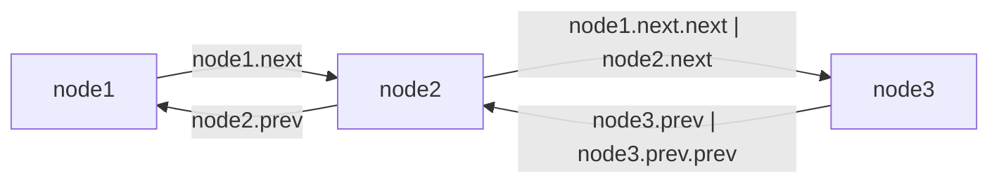

> Collection Framework 내 List 자료구조 중 LinkedList 정리

# LinkedList
Java에서 제공하는 `List` 형태의 자료 구조 중 하나로써, `ArrayList` 에서 한계로 지적되는 중간 데이터 삽입 및 수정 시 `O(n)`의 처리량과 내부적으로 **배열**을 사용함으로써, 일부 할당된 메모리 내 빈 공간이 남게 되는 문제들을 개선한 `List` 구조의 구현체이다.

```java
LinkedList<String> list = new LinkedList<>();
```

주로 위와 같이 초기화 하여 사용할 수 있다.

## Node
`LinkedList`에서는 `ArrayList`와 다르게 **배열**이 아닌 `Node`라는 내부 객체를 사용하여 데이터들을 관리한다.

```java
public class LinkedList<E> {
	...
	private static class Node<E> {  
	    E item;  
	    Node<E> next;  
	    Node<E> prev;  
	}
	...
}
```

`LinkedList` 객체 내부에 위와 같이 `Generic Class`로 구현되어 있으며, **타입 매개변수**에 주입되는 데이터 타입 형태의 `item` 필드에 데이터를 적재하게 된다.

`Node` 객체의 주요 특징 중 하나로 `Node` 객체의 필드 중 `next`와 `prev` 는 각각 `Node` 타입의 필드로 구현되어 있는데, 여기에 현재 `Node`와 연결된 앞선 `Node`객체와 이후 `Node`객체를 참조하여 서로 연결하도록 지원한다.

### Node의 연결


결과적으로 `LinkedList`는 이러한 `Node`객체들을 서로 참조하여 위와 같이 연결된 상태로 데이터를 관리하는 자료구조 객체이다.

## LinkedList 구조
Java의 `LinkedList` 는 위와 같은 `Node` 객체를 기반으로 대략 아래와 같이 구성되어 있다.
```java
public class LinkedList<E> {
	...
	transient int size = 0;  
	transient Node<E> first;  
    transient Node<E> last;
    ...
}
```

`Node`객체를 통해 데이터 간 참조 값을 통해 순차적으로 데이터를 관리하며, 현재 형상의 첫 번째 `Node`와 마지막 `Node`를 기반으로 조회 및 추가 등의 메소드를 제공한다.
- *첫 번째 `Node`와 마지막 `Node`를 별도 관리하기에 첫번째 값과 끝 값 조회의 경우 `O(1)`임*

### 신규 데이터 삽입
`LinkedList`에서의 데이터 삽입은 `List`자료구조 답게 순차적으로 추가하는 방법을 제공한다.
#### add(E e)
순차적으로 삽입하는 경우 `add()` 메소드를 통해 삽입할 수 있으며, 내부적으로는 아래와 같은 구조로 이루어져 있다.
```java
...
public boolean add(E e) {  
    linkLast(e);  
    return true;  
}
...
void linkLast(E e) {  
    final Node<E> l = last;  
    final Node<E> newNode = new Node<>(l, e, null);  
    last = newNode;  
    if (l == null)  
        first = newNode;  
    else  
        l.next = newNode;  
    size++;  
    modCount++;  
}
```
`LinkedList`에서 마지막 `Node`를 관리하고 있기에 마지막 `Node`에 인자로 주어진 데이터가 삽입된 신규 `Node`를 현재 기준 마지막 `Node` 내 `next` 요소에 참조해둠으로써 연결을 시켜준다.

이후, 관리중인 마지막 `Node`를 신규 생성하여 연결된 `Node`로 변경함으로써 신규 데이터 삽입이 완료된다.

### 임의 위치 삽입 및 삭제
`LinkedList` 또한 `ArrayList`와 마찬가지로 신규 데이터 삽입 시 맨 끝 뿐 아니라, 중간 혹은 임의의 위치에 신규 데이터를 삽입하거나 삭제할 수 있다.

#### add(int index, E element)
`LinkedList`에서는 특정 `index`에 데이터를 삽입하기 위해 `add(int, E)`메소드를 지원하며, 해당 메소드는 아래와 같이 구현되어 있다.

```java
public void add(int index, E element) {  
    checkPositionIndex(index);  
  
    if (index == size)  
        linkLast(element);  
    else  
        linkBefore(element, node(index));  
}
```

기본적으로 `ArrayList`와 마찬가지로 현재 삽입 가능한 `index`인지 여부를 확인한 후, 주어진 `index`가 만약 현재 `size`일 경우, 아래와 같이 마지막 `Node`를 관리하고 있기에 거기에 신규 `Node`를 연결함으로써 작업이 완료 된다.
```java
void linkLast(E e) {  
    final Node<E> l = last;  
    final Node<E> newNode = new Node<>(l, e, null);  
    last = newNode;  
    if (l == null)  
        first = newNode;  
    else  
        l.next = newNode;  
    size++;  
    modCount++;  
}
```
- *해당하는 경우에 `O(1)` 의 연산속도를 지님*

허나, 만약 위와 달리 `index`가 임의의 위치일 경우, 아래와 같은 추가 작업을 통해 신규 삽입될 `Node`의 바로 앞 `Node`를 식별해야 한다.
```java
Node<E> node(int index) {  
    // assert isElementIndex(index);  
  
    if (index < (size >> 1)) {  
        Node<E> x = first;  
        for (int i = 0; i < index; i++)  
            x = x.next;  
        return x;  
    } else {  
        Node<E> x = last;  
        for (int i = size - 1; i > index; i--)  
            x = x.prev;  
        return x;  
    }  
}
```

신규 삽입을 위해 해당 위치의 `Node`를 조회하기 위해서는 위와 같이 해당 위치만큼 순회를 돌아 접근하게 된다.
- *이 때, `LinkedList`는 첫번쨰 `Node`와 마지막 `Node`를 별도 관리하고 있기에, 현재 관리중인 데이터들의 총 개수를 기준으로 하여 보다 가까운 쪽에서부터 순회를 돌도록 함*

이후, 추가 삽입할 위치의 기존 `Node`에 아래와 같이 추가 데이터에 대한 신규 `Node`를 생성해서 연결해준다.
```java
void linkBefore(E e, Node<E> succ) {  
    // assert succ != null;  
    final Node<E> pred = succ.prev;  
    final Node<E> newNode = new Node<>(pred, e, succ);  
    succ.prev = newNode;  
    if (pred == null)  
        first = newNode;  
    else  
        pred.next = newNode;  
    size++;  
    modCount++;  
}
```
위와 같이 신규 삽입된 `Node`와 기존 `Node`를 연결해주고, 기존 `Node`와 연결되어 있던 이전 `Node`를 신규 `Node`와 연결함으로써 임의의 위치에 신규 `Node`를 연결하게 된다.

#### remove(int index)
`LinkedList`에서는 임의의 위치의 데이터를 삭제하기 위해 `remove(int index)` 메소드를 지원한다.

```java
public E remove(int index) {  
    checkElementIndex(index);  
    return unlink(node(index));  
}
```
제거할 `Node`를 찾기 위한 동작이 앞선 `add(int index E e)`와 동일하며, 그렇게 찾은 `Node`의 앞뒤 연결을 제거하고, 각 앞뒤 `Node`를 서로 연결함으로써 해당 `Node`를 제거힐 수 있다.

> [!NOTE]
> **ArrayList와 LinkedList 연산 속도 차이**
> 
> `ArrayList`의 경우 마지막 위치가 아닌 임의의 위치에 데이터를 삽입하거나 삭제할 경우, 해당 위치를 찾기위해 `index`를 통해 `O(1)`의 연산이 소요되며, 삽입 혹은 삭제 이후 기존 데이터들을 재정렬 하기 위해 `O(n)`의 연산이 소요된다.
> 
> 이와 반대로 `LinkedList`는 데이터를 삽입하거나 삭제하기 위한 위치를 찾는데 `Node` 끼리의 연결 순회를 통해 `O(n)`의 연산이 소요되며, 삽입 혹은 삭제 후 기존 데이터들의 연결 작업에 `O(1)`의 연산이 소요 된다.