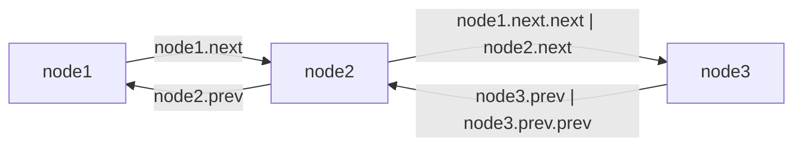

> Collection Framework 내 List 자료구조 중 LinkedList 정리

# LinkedList
Java에서 제공하는 `List` 형태의 자료 구조 중 하나로써, `ArrayList` 에서 한계로 지적되는 중간 데이터 삽입 및 수정 시 `O(n)`의 처리량과 내부적으로 **배열**을 사용함으로써, 일부 할당된 메모리 내 빈 공간이 남게 되는 문제들을 개선한 `List` 구조의 구현체이다.

```java
LinkedList<String> list = new LinkedList<>();
```

주로 위와 같이 초기화 하여 사용할 수 있다.

## Node
`LinkedList`에서는 `ArrayList`와 다르게 **배열**이 아닌 `Node`라는 내부 객체를 사용하여 데이터들을 관리한다.

```java
public class LinkedList<E> {
	...
	private static class Node<E> {  
	    E item;  
	    Node<E> next;  
	    Node<E> prev;  
	}
	...
}
```

`LinkedList` 객체 내부에 위와 같이 `Generic Class`로 구현되어 있으며, **타입 매개변수**에 주입되는 데이터 타입 형태의 `item` 필드에 데이터를 적재하게 된다.

`Node` 객체의 주요 특징 중 하나로 `Node` 객체의 필드 중 `next`와 `prev` 는 각각 `Node` 타입의 필드로 구현되어 있는데, 여기에 현재 `Node`와 연결된 앞선 `Node`객체와 이후 `Node`객체를 참조하여 서로 연결하도록 지원한다.

### Node의 연결


결과적으로 `LinkedList`는 이러한 `Node`객체들을 서로 참조하여 위와 같이 연결된 상태로 데이터를 관리하는 자료구조 객체이다.