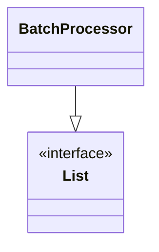
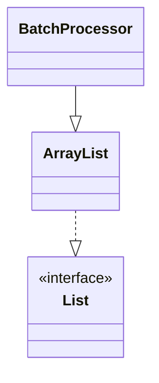
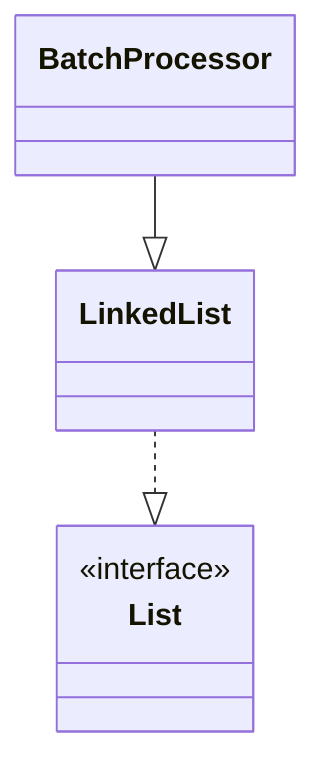

> Java의 List 자료구조에 대한 최상위 인터페이스

# List란?
자료구조 중 `List`의 경우 중복 데이터를 허용한 채 입력 순서대로 데이터를 관리하는 자료구조이다. Java에서는 이러한 `List` 자료구조에 대해 `ArrayList`와 `LinkedList` 등 다양한 `List` 형태의 객체를 지원한다.
```java
ArrayList<String> arrayList = new ArrayList<>();
LinkedList<String> linkedList = new LinkedList<>();
```


## List의 추상화
이에 따라 `List` 자료구조에서 제공해야할 기능들 일반적으로 동일하기에 `ArrayList`나 `LinkedList`는 하나로 추상화 하여 사용할 수 있으며, Java 에서는 이러한 추상화 기법을 통해 아래와 같은 `List` 자료구조의 인터페이스 객체를 지원한다.

```java
public interface List<E> extends Collection<E> {
	...
	boolean add(E e)
	boolean remove(Object o)
	...
}
```

이에 따라, `ArrayList`나 `LinkedList` 등 `List` 형태의 자료구조 구현체들은 대부분 `List` 인터페이스를 상위 인터페이스로 두고 있기에 아래와 같이 추상화된 변수에 상황에 따라 다양하게 할당 할 수 있다.
```java
List<String> list1 = new ArrayList<>();
List<String> list2 = new LinkedList<>();
```

### 추상화를 통한 다형성
`ArrayList`와 `LinkedList`와 같이 동일한 기능을 하는 객체를 하나의 추상화된 객체 내 하위 구현체로 둘 경우 아래와 같이 하위 여러 구현체를 입력으로 받아올 수 있다.
```java
public class BatchProcessor<E> {  
    private List<E> list;  
  
    public BatchProcessor(List<E> list) {  
        this.list = list;  
    }
    ...
}
```

위의 경우 `List` 인터페이스를 매개변수로 받아오기에, `List`인터페이스에 해당하는 하위 구현체들인 `ArrayList`나 `LinkedList`또한 매개변수로 입력받을 수 있게 되며, 이를 통해 객체지향 프로그래밍의 주요 특징 중 하나인 **다형성**의 이점을 발휘할 수 있게 된다.

이에 따라 위의 `BatchProcessor` 객체는 컴파일 시점에는 아래와 같은 의존 관계만을 지니게 된다.



만약 위의 객체를 상황에 따라 `ArrayList`를 쓰거나 `LinkedList`를 써야 하는 경우, 구현된 객체를 수정할 필요 없이 아래와 같이 해당 구현체를 매개변수로 주도록 신규 인스턴스를 생성하여 사용할 수 있다.
```java
BatchProcessor<String> array = new BatchProcessor<>(new ArrayList<>()); 
BatchProcessor<String> link = new BatchProcessor<>(new LinkedList<>());
```

이에 따라 인자로 주어지는 객체의 타입마다 런타임 시점에 실제 아래와 같은 의존 관계를 지니게 된다.

**주어진 매개변수가 `ArrayList`일 경우**


**주어진 매개변수가 `LinkedList`일 경우**


> [!NOTE]
> **Strategy Pattern**
> 
> 객체지향 언어인 Java에서는 위와 같이 로직에 필요한 객체의 구현체를 외부로부터 주입 받으며, 내부 로직은 추상화된 객체나 인터페이스를 사용하도록 하여, 유연한 의존 관계를 형성함으로써, 다양한 구현체를 상황에 따라 추가하거나 변경할 수 있도록 구성하는 것을 **Strategy Pattern** , **전략 패턴** 이라고 한다.