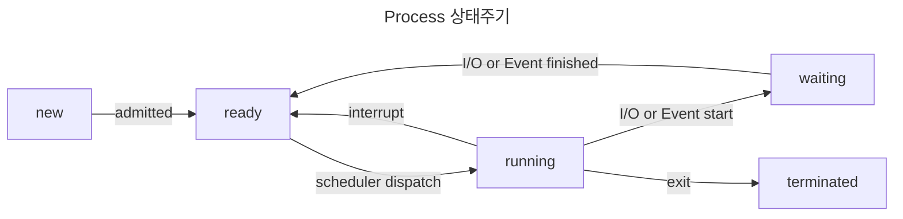
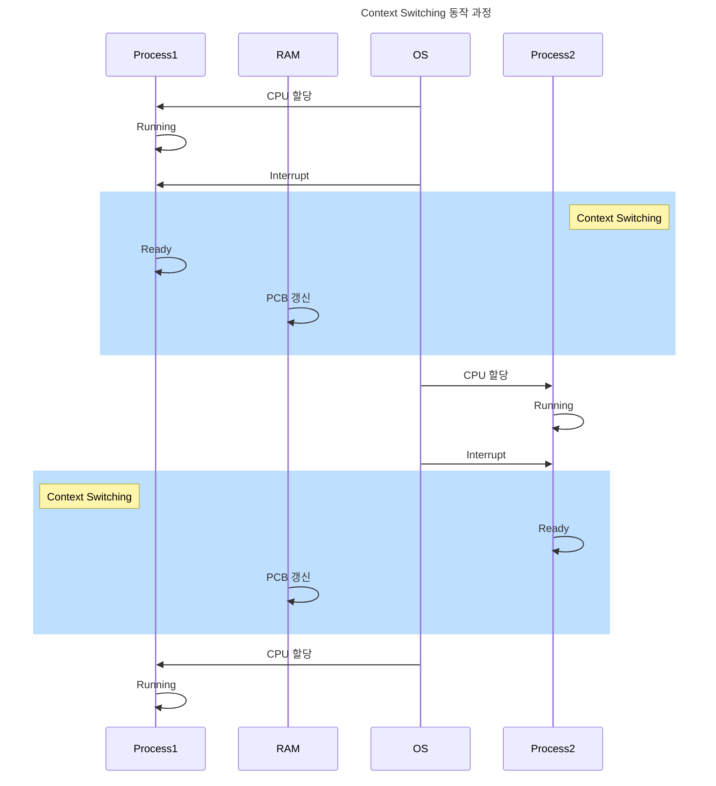

> 운영제체 기초 : Context Switch

# Context란?
CPU는 실제로는 하나의 `Process`, `Thread`만을 처리할 수 있으며, 이를 동시에 처리하도록 보이기 위해서 지속적으로 `Process`나 `Thread`들을 번갈아가면서 작업을 수행하며, 이 때 `Process` 및 `Thread`에 현재 작업 상태 및 정보들을 `Context`라고 하며 이는 OS 커널 내 `PCB`라는 영역에 저장 및 관리된다.

## PCB : Process Control Block
OS에서 `Context`들을 관리하는 자료구조의 일종으로 `Context Switching`은 해당 자료구조에 저장된 `Context`들을 교체하고 캐시를 비우는 일련의 작업이다.

# Context Switch 조건
`Context Switcing`은 `Process`의 상태에 따라 크게 아래 두 경우에 발생한다.
1. `Process`가 running 상태에서 waiting 상태로 전환될 때
2. `Process`가 running 상태에서 ready 상태로 전환될 때

## Process 상태

`Context Switching`은 `Process`의 특정 상태에 따라 작업을 수행하게 되며, 이러한 상태 주기는 위와 같다.
- New : `Process` 생성 단계
- Ready : `Process`가 CPU를 할당받기 위해 대기중인 상태
- Running : `Process`가 CPU를 할당받아 작업을 수행중인 상태
- Waiting : `Process`가 I/O 작업이나 기타 이벤트가 발생하여 대기하는 상태
- Terminated : `Process` 종료 단계

## Context Switch 동작 흐름

위와 같이 `Process`의 상태 변환 및 할당 간에 `Context Switching`이 동작한다.

## TCB : Thread Control Block
`Process`의 `Context` 정보를 담는 `PCB` 뿐만 아니라 `Process`에 의해 실제 작업이 수행되는 `Thread` 에서도 `Context Switching`을 위한 데이터 저장 공간이 별도로 존재한다.

`TCB`는 `PCB` 의 하위에 포함되어 있으며, 각 `TCB` 는 자신의 부모 `PCB` 정보를 지니고 있다.

### Thread에 대한 Context Switching
`Thread`에 대한 `ContextSwitching`은 `Process`에 대한 `Context Switching` 에 비해 발생 비용이 상대적으로 적은데, 이는 `Process`가 서로 독립적인데 반해, `Thread`는 일부 메모리를 공유하기에 상대적으로 전환 간에 발생하는 비용이 적다.

