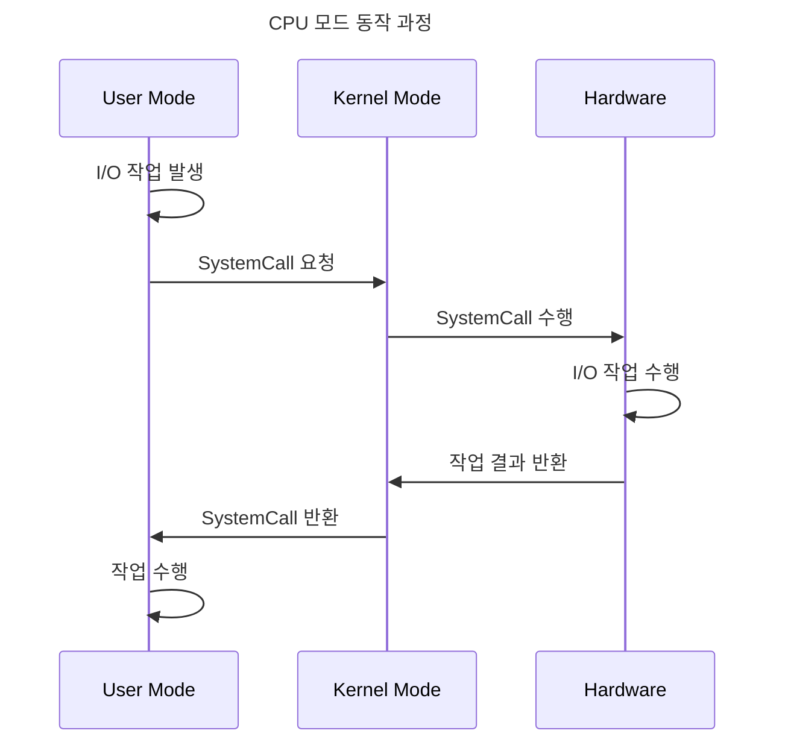

> 운영체제 기초 : 사용자 모드와 커널 모드

# CPU 권한 모드
CPU는 작업간에 크게 두 가지의 모드를 번갈아가며 작업을 수행하게 되며, 이를 각각 `사용자 모드`와 `커널 모드`라고 한다.

운영체제는 각종 응용프로그램과 하드웨어 사이의 중개자 역할을 하며, 응용프로그램에서의 하드웨어 직접 접근을 막고 한정된 인터페이스를 제공하여 하드웨어에 간접적으로 접근할 수 있도록 한다.
- 직접 접근이 가능할 경우 정상적으로 `Process`를 수행할 수 없게 될 수 있으며, 효율적인 자원관리에 어려움이 생긴다.
- 이러한 작업에 대한 주요 부분을 `Kernel`이라고 한다.

## 사용자 모드
CPU 작업 수행 간에 모드를 표시하는 `Mode bit` 가 1인 상태를 뜻하며, 응용프로그램의 코드가 수행되는 시점의 모드로써, 오로지 메모리의 유저 영억만 접근이 가능하다.

## 커널 모드
`Mode bit`가 0인 상태를 뜻하며, I/O 작업이나 기타 하드웨어 접근이 필요한 작업에 도달할 경우 해당 모드로 변환하여 하드웨어에 접근하도록 한다.
- 접근하여 작업 수행 후 다시 사용자 모드로 변환된다.

# System Call
실제 CPU가 작업 수행 간에 `사용자 모드`와 `커널 모드` 사이의 모드 전환을 위해 존재하는 OS에서 제공하는 인터페이스이다.

`사용자 모드`에서 하드웨어 접근이 필요할 때 `System Call`을 호출하여 `커널 모드`로 전환하여 작업을 수행하도록 돕고, 작업 결과 반환과 함께 다시 `사용자 모드`로 전환한다.

## CPU 모드 동작 과정

