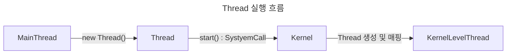

> Java Thread의 실행과 종료

# Thread 실행
`Thread` 객체에서 제공하는 `start()` 메소드를 통해 해당 `Thread`의 실행을 요청 할 수 있다.



내부적으로 JVM에서 System Call을 호출하여 `Kernel Level Thread`를 생성하여 Java 의 `Thread` 에 매핑된다.

매핑된 Java `Thread`는 이후 `run()` 를 실행하여, 작업을 수행한다.

## run()
`Thread`가 `Kernel Level Thread`에 매핑된 후에 내부적으로 `Thread`가 지닌 `run()` 메소드를 호출한다.

```java
public class Thread implements Runnable {
...
	/* What will be run. */  
	private Runnable target;
	...
	@Override  
	public void run() {  
	    if (target != null) {  
	        target.run();  
	    }  
	}
...
}
```

이 때 `run()` 메소드는 내부적으로 현재 `Thread`에 `Runnable` 구현체가 존재할 경우 해당 구현체의 `run()` 메소드를 호출한다.

> [!NOTE]
> 
> **run() 메소드 실행 주체**
> 
> 만약 `Thread`의 `run()`를 직접적으로 호출할 경우에는 `start()`메소드를 통한 SystemCall이 수행되지 않았기에 직접 호출한 `Thread`에서 작업이 수행된다.

# Thread 종료
`Thread`는 `run()`메소드를 통한 작업 수행이 끝날 경우 자동으로 종료된다.
- *단 해당 `Process`가 `SingleThread`인지 `MultiThread`인지에 따라 종료 조건이 상이함*

**SingleThread 종료 조건**
`Thread`가 하나뿐인 경우 해당 `Thread`의 작업이 종료되면 해당 `Process`가 종료된다.

**MultiThread 종료 조건**
`Thread`가 다수인 경우, 실행된 `Thread`들이 전부 종료되어야 해당 `Process`가 종료된다.
