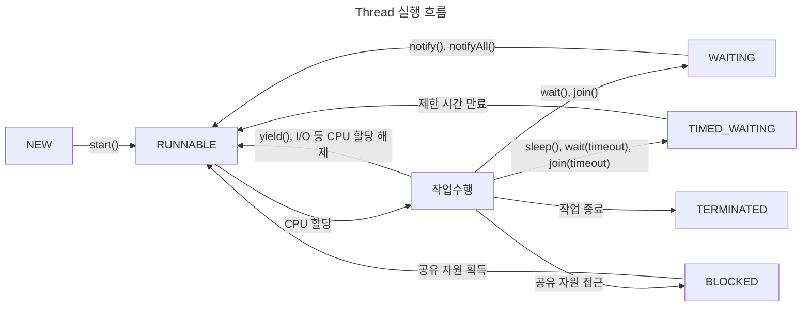

> Thread의 생명주기와 상태

# Thread 상태
JVM에서 생성되는 모든 `Thread`들은 `Kernel Level Thread`와는 별개의 상태 값을 어느 시점이든 1개를 지니고 있다.

주로 아래 6가지의 상태가 생명주기에 따라 갱신되면서 `Thread`가 작업을 수행하게 된다.

| 상태        | ENUM            | 설명                                                       |
| --------- | --------------- | -------------------------------------------------------- |
| Thread 생성 | `NEW`           | Thread 객체가 생성되었으나 아직 실행되지 않은 상태                          |
| 실행 대기     | `RUNNABLE`      | Thread가 실행 중이거나 실행 가능한 상태                                |
| 일시 정지     | `WAITING`       | 다른 Thread가 작업 중인 동안 대기중인 상태                              |
| 일시 정지     | `TIMED_WAITING` | 특정 대기 시간이 지정된 경우, 시간에 도달하여 다른 Thread에게 작업을 넘긴 상태         |
| 일시 정지     | `BLOCKED`       | 다른 Thread가 이미 선점한 공유 자원에 대해 접근 시, 공유 자원을 취득하기 위해 대기하는 상태 |
| 종료        | `TERMINATED`    | Thread가 작업을 마친 상태                                        |
# Thread 생명주기
`Thread`는 결국 6가지의 상태에 따라 생명주기가 구성되며 각 상태 변경 시마다 `Context Switching`이 발생한다.

## NEW -> RUNNABLE
신규 생성된 `Thread` 객체의  `start()`메소드 호출 시 현재 `Thread`의 상태가 `RUNNABLE`로 변경된다.

## RUNNABLE <-> 작업 수행
`RUNNABLE` 상태인 `Thread`가 OS의 스케줄링에 의해 CPU를 할당받을 시 실제 작업을 수행한다.

## RUNNABLE <-> WAITING
`RUNNABLE` 상태의 작업을 진행중인 `Thread`가 다른 `Thread`의 작업 결과를 기다리거나, `wait()`, `join()` 메소드 호출 시 `WAITING` 상태로 변경된다.

이후 다른 `Thread`에서 `notify()`나 `notifyAll()` 등의 메소드 호출을 하거나 하위 `Thread`의 작업이 종료될 경우 다시 상태가 `RUNNABLE`로 변경된다.

## RUNNABLE <-> TIMED_WAITING
`RUNNABLE` 상태의 작업을 진행 중인 `Thread`가 `sleep()`이나 `wait(timeout)` 등 특정 대기시간을 할당 받은 경우 해당 시간동안 `TIMED_WAITING` 상태가 된다.

이후 해당 대기시간이 지날 경우 다시 `RUNNABLE 상태로 변경된다.

## RUNNABLE <-> BLOCKED
`RUNNABLE` 상태의 작업을 진행중인 `Thread`가 다른 `Thread`가 이미 사용중인 공유 자원에 접근할 경우 앞서 사용중인 `Thread`가 공유 자원에 대한 접근을 마치기 전까지 `BLOCKED 상태가 된다.

## RUNNABLE -> TERMINATED
`RUNNABLE` 상태의 작업을 진행중이던 `Thread`의 작업이 종료될 경우 `TERMINATED` 상태로 변경된다.