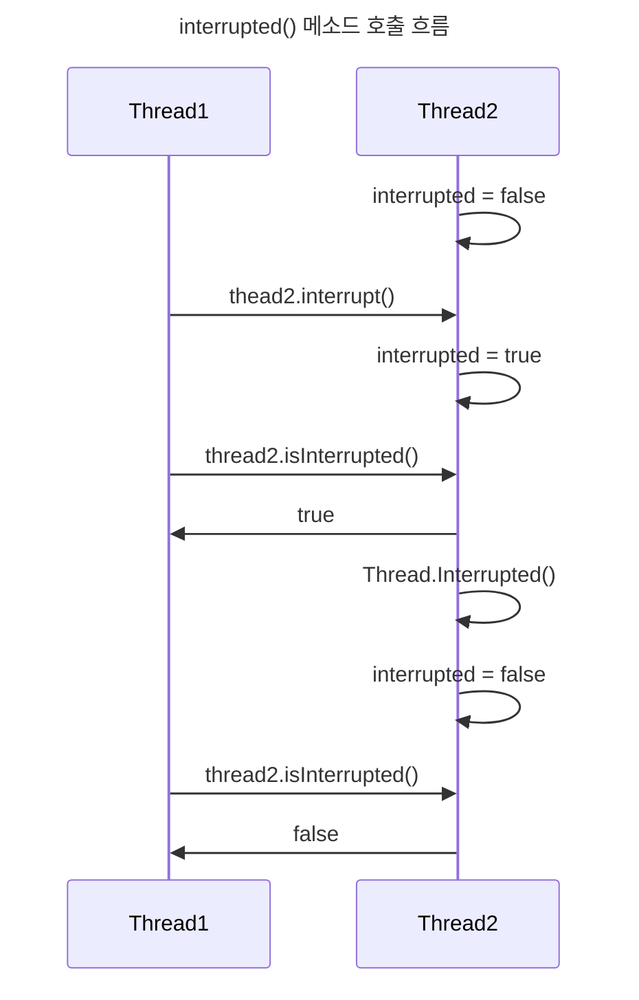

> Java Thread API : Interrupt

# Interrupt란?
`Thread` 에서 관리 하는 상태 값으로 `interrupted` 가 존재하며 `Thread`의 `interrupt()` 메소드 호출을 통해 해당  `interrupted` 상태 값을 변경할 수 있다.

`Thread` 작업 수행 간 `interrupted` 상태 값을 통해 다른  `Thread` 에서 들어온 `interrupt()` 메소드에 따라 해당 `Thread`의 작업 분기를 설정 할 수 있게 된다.

## interrupt()
특정 `Thread`에게 `interrupt` 가 발생했음을 알리는 메소드이며, 호출된 `Thread` 의 `interrupted` 상태 값이 true로 변경된다.
- *`interrupt()`는 자기 자신이나 다른 `Thread`에서 호출 할 수 있음*

## interrupted()
정적 메소드로써 현재 `Thread`의 `interrupted` 상태 값을 반환하며, 이 때 반환된 값이 true일 경우, `interrupted`를 false 로 초기화한다.

## isInterrupted()
특정 `Thread`의 현재 `interuppted` 상태 값을 반환한다.
- *`interrupted()` 와는 달리 상태가 초기화되지 않음*

## 메소드 호출 별 상태

`interrupted()` 호출 이전까지는 `interrupt()` 에 의해 `interrupted` 상태가 true 였으나, `interrupted()` 호출을 통해 `interrupted` 상태가 false로 초기화 된다.

> [!NOTE]
> **InterruptedException**
> 
> `InterruptedException` 은 `wait()`, `sleep()` 등의 대기 상태 변환 메소드에서 발생할 수 있는 예외로써, 해당 대기 상태 간 `interrupted` 상태 값이 true로 변경되었을 때 발생하는 예외이다.
> 
> `interrupted()` 메소드처럼 해당 예외가 발생하면 `interrupted` 상태 값은 false 로 초기화 된다.
