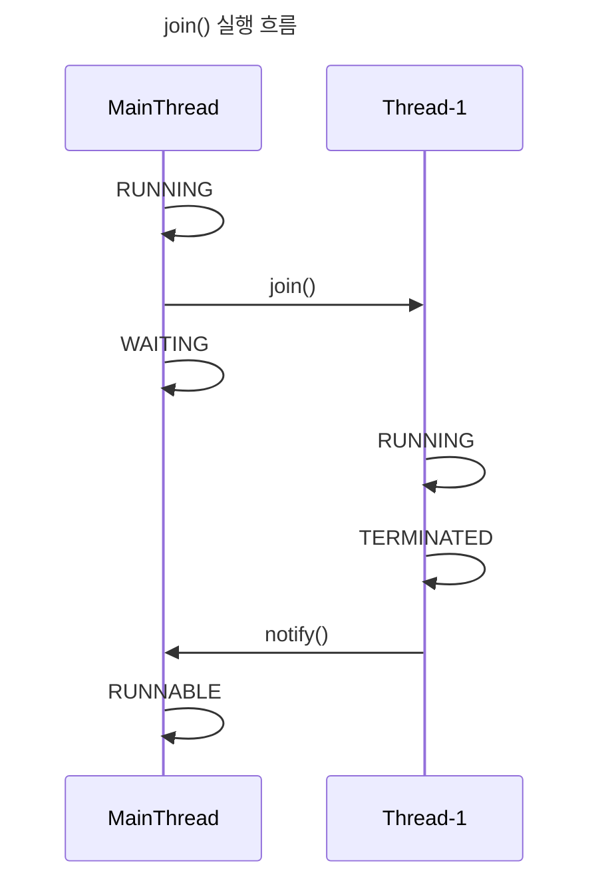

> Java Thread API : Join

# join()
Java `Thread` 라이브러리에서 제공하는 메소드로써, 특정 `Thread`의 `join()` 메소드를 호출할 경우, 호출한 `Thread` 는 호출당한 `Thread`의 작업이 종료될 때 까지 대기상태로 전환된다.

호출한 `Thread` 가 호출 당한 `Thread` 의 작업 완료 여부에 종속되게 되며, 주로 순차적인 처리 작업 등에 사용된다.

## 메소드 구조
```java
...
public final void join() throws InterruptedException {  
    join(0);  
}
...
public final synchronized void join(final long millis)  
throws InterruptedException {  
    if (millis > 0) {  
        if (isAlive()) {  
            final long startTime = System.nanoTime();  
            long delay = millis;  
            do {  
                wait(delay);  
            } while (isAlive() && (delay = millis -  
                    TimeUnit.NANOSECONDS.toMillis(System.nanoTime() - startTime)) > 0);  
        }  
    } else if (millis == 0) {  
        while (isAlive()) {  
            wait(0);  
        }  
    } else {  
        throw new IllegalArgumentException("timeout value is negative");  
    }  
}
...
public final native void wait(long timeoutMillis) throws InterruptedException;
...
```

위와 같은 메소드들로 이루어져 있으며 `join()` 메소드 호출 시 내부적으로는 `wait()` 메소드가 호출되며 이는 `native` 메소드이기에 `kernel` 에게 System Call을 호출하게 된다.
- *상태 변경이 수반되기에 `Context Switching`이 발생함.*


### join() 실행 흐름


위와 같이 `join()` 호출 시 호출한 `Thread`는 `wait()` 메소드에 의해 `WAITING` 상태로 전환되며, 이후 `join()` 이 수행된 `Thread` 의 상태가 `TERMINATED` 가 되어야, `notify()` 메소드 호출로 인해 `WAITING` 상태 였던 `Thread`가 다시 `RUNNABLE` 상태로 전환되게 된다.

## 사용 예시
```java
package com.guardjo.practice.java.concurrent.chapter03;  
  
public class ThreadJoinExecutor {  
    public static void main(String[] args) {  
        Thread mainThread = Thread.currentThread();  
        Thread thread = new Thread(() -> {  
            System.out.println("Join() Test");  
            System.out.println(Thread.currentThread().getName() + " state : " + Thread.currentThread().getState());  
            System.out.println(mainThread.getName() + " state : " + mainThread.getState());  
        });  
  
        thread.start();  
  
        try {  
            System.out.println("Main Thread Start");  
            System.out.println("SubThread Join");  
            thread.join();  
            System.out.println("Main Thread Restart");  
        } catch (InterruptedException e) {  
            throw new RuntimeException(e);  
        }  
    }  
}
```


위와 같이 `join()` 함수를 호출하여 사용할 수 있으며, 위의 경우에는 `Thread` 작업 간 `Main Thread`는 `WAITING` 상태로 대기 중이게 된다.