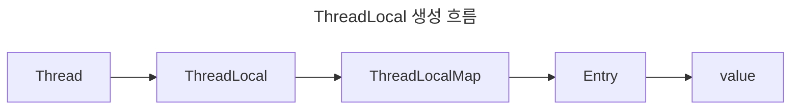

> Java Thread Local

# ThreadLocal
`Thread` 별로 독립적인 변수들을 관리할 수 있는 저장 객체로, 각 `Thread` 는 각자의 `ThreadLocal` 에만 접근할 수 있다.
- *`ThreadLocal`은 위치나 주입 인자 없이 전역변수처럼 접근해서 사용할 수 있음*
- *주로 여러 `Thread`가 공통적으로 처리해야하는 로직이나 객체 제어 상황에 필요함*
	- *트랜잭션, 로그 추적 등*

## ThreadLocal 생성


각 `Thread` 별로 내부 필드로 `threadLocals`라는 이름의 `ThreadLocal` 객체를 지니고 있으며, `ThreadLocal`은 내부적으로 `ThreadLocalMap`이라는 객체로 이루어져 있어, 해당 Map의 키값을 기준으로 `Thread` 별로 별도 저장 공간을 분리하여 반환하는 방식으로 이루어져 있다.

각 `Thread`에 대한 식별은 `currentThread()` 메소드를 통해 이루어지며, 결국 이러한 생성 방식 덕에, 각 `Thread` 별로 독자적인 데이터로 취급되어 동시성 문제가 발생하지 않는다.

> [!NOTE]
> **ThreadPool에서의 ThreadLocal 관리**
> 
> 일반 `Thread`의 경우 별도로 `TheradLocal` 데이터를 정리하지 않더라도, `Thread` 에 종속적이기에 큰 문제가 발생하지 않으나, `ThreadPool`의 경우 기존에 생성한 `Thread`를 재사용하기에 앞선 `Thread`에 대한 task를 마치면 `ThreadLocal`을 정리해주어야 한다.

# InheritableThreadLocal
기존 `ThreadLocal`의 확장 객체로, 특정 `Thread`의 하위로 생성된 `Thread`에서 상위 `Thread`의 `ThreadLocal` 데이터에 접근할 수 있도록 하는 객체이다.

```java
package com.guardjo.practice.java.concurrent.chapter04;  
  
public class InheritableThreadLocalExample {  
    private final static InheritableThreadLocal<String> threadLocal = new InheritableThreadLocal<>();  
  
    public static void main(String[] args) throws InterruptedException {  
        threadLocal.set("Parent");  
  
        Thread thread = new Thread(() -> {  
            System.out.println(Thread.currentThread().getName() + " : " + threadLocal.get());  
            threadLocal.set("child");  
            System.out.println(Thread.currentThread().getName() + " : " + threadLocal.get());  
        });  
  
        thread.start();  
        thread.join();  
  
        System.out.println(Thread.currentThread().getName() + " : " + threadLocal.get());  
    }  
}
```

위와 같이 기존 `ThreadLocal`과 동일한 방식으로 사용할 수 있으며, 하위 `Thread`에서는 상위 `Thread` 에서 저장한 데이터를 읽을 수 있다.
- 하위 `Thread`가 데이터를 수정할 수도 있으나, 상위 `Thread`의 `ThreadLocal`에 전파되지는 않는다.