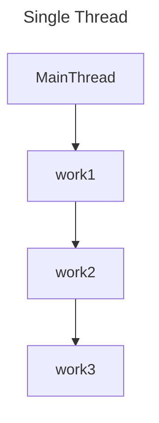
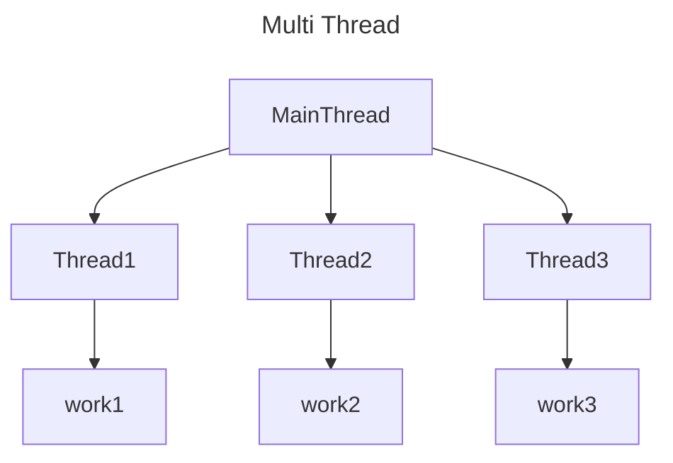

> 동기화 기초 :  Single Thread 와 Multi Thread

# Single Thread Process
단일 `Thread`로만 실행되는 `Process`로, `Thread`가 하나 뿐이기에 별도의 `Context Switching`이 발생하지 않으며, 별도의 동시성 문제가 발생하지 않는 `Process`이다.

단, 단일 `Thread` 이기에 멀티 코어 CPU를 활용하지 못하며, I/O 처리 진입 시 CPU가 놀아 자원을 낭비하게 된다.

# Multi Thread Process
다중 `Thread`로 실행되는 `Process`로, 다중 `Thread`를 통한 동시/병렬 처리가 가능하며, 이를 통해 CPU 자원의 효율적인 사용이 가능하다.

단, 다중  `Thread`이기에 각 `Thread` 별 동시성 이슈 등을 관리하여야 하며, `Context Switching`으로 인한 일부 성능 저하가 발생할 수 있다.

> [!NOTE]
> **Multi Thread Process의 동시성 이슈**
> 
> `Multi Thread` 환경에서 동일한 메모리 영역에 대해 다수의 `Thread`가 접근하여 읽기, 쓰기 작업 등이 이루어질 경우 `Thread`마다 읽거나 갱신된 데이터가 일치하지 않아 정합성이 무너질 수 있는 이슈가 존재한다.
> 
> Java에서는 다양한 방식으로 이러한 동시성 이슈들을 해결하고자 한다.

