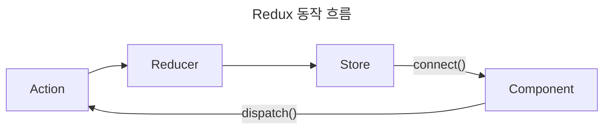

> Redux 기초

# Redux
`Context`와 마찬가지로 데이터를 관리하는 기술이며, 여러 컴포넌트가 공유하는 상태를 관리하기 위한 라이브러리이다.
- `Context`와 비슷하게 `Provider`와 `Consumer`와 관계와 비슷하지만 `Context`와 달리 단일 `Provider` 로 관리된다.

## 동작 방식


`Redux`는 `Store`에서 데이터를 관리하는 라이브러리이다.

전체적인 흐름은 위와 같으며, `Component`는 `dispatch()` 함수 호출을 통해 `Action`을 `Reducer`에 전달한다.
`Reducer`는 `Action`을 받아 `Store`에 저장된 특정 데이터에 대한 변경 작업을 수행하고, 변경된 데이터는 `connect()` 함수로 연결된 `Component`에 반영된다.

## Store 구성
```text
createState(
	Reducer, Reducer 함수
	initState, // 초기 상태 데이터
	Enhancer // Reducer 함수가 수행될 때 함께 수행되는 함수
)
```

기본적으로 `Store`는 위와 같은 인자들로 구성된 `createStore()`함수를 통해 생성할 수 있다.

### 구성 예시


```jsx
import React, { PureComponent } from "react";
import { Provider } from "react-redux";
import { createStore } from "redux";

export default class ReduxApp extends PureComponent {
    store = createStore(
        state => state,
        { loading: false, name : "Test 상태"},
        window.__REDUX_DEVTOOLS_EXTENSION__ && window.__REDUX_DEVTOOLS_EXTENSION__());

    render() {
        return (
            <Provider store={this.store}>
                리덕스 예제
            </Provider>
        );
    }
}
```

위와 같이 단순 state를 그대로 반환하는 `Reducer`와 기본 상태값을 지정, 브라우저 devtool 내 Redux연동 함수를 통해 현재 구성된 Redux `Store`에 저장된 상태를 확인할 수 있다.