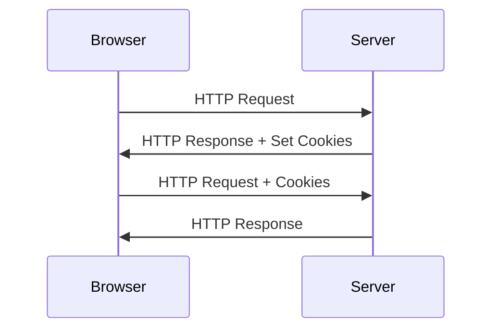
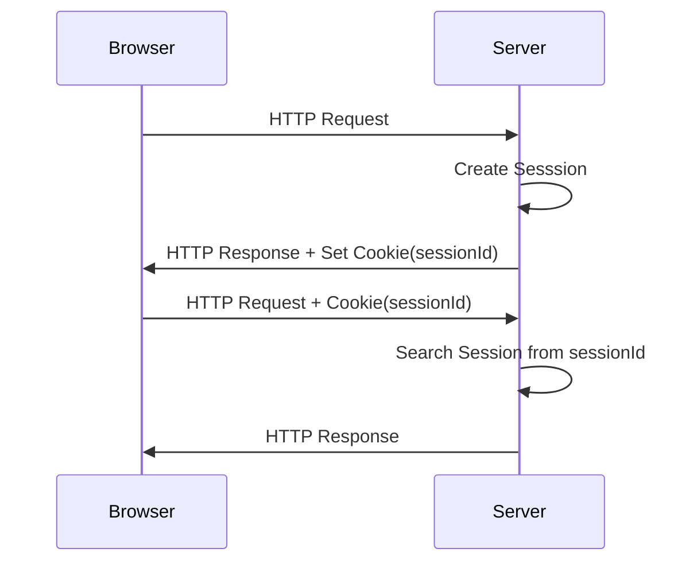

> HTTP에서 사용하는 Session과 Cookie 에 대한 정리
# 1. Cookie
HTTP 헤더에 존재하는 요소 중 하나로써 [[http|HTTP 프로토콜]]에서의 Connectless, Stateless 에 대한 단점을 보완하기 위해 주로 사용된다.
- 요청마다 연결이 종료되기에, 상태를 기억하기가 쉽지않아, 클라이언트(브라우저)에서 해당 요청에 대한 응답 및 상태를 Cookie에 저장함으로써 상태 관리를 할 수 있게 도와 준다.
- *Cookie의 경우 최대 300개의 Cookie를 저장할 수 있으며, 도메인별 20개, Cookie당 최대 4KB까지 저장할 수 있다.*
## 1-1. Cookie의 구조
**Name**
- Cookie의 이름
**Value**
- Cookie에 저장된 값
**Expired**
- Cookie의 유효기간
- 유효기간이 지난 Cookie들은 제거됨
>[!NOTE]
>**Cookie 유효기간에 따른 분류**
>
>Session Cookie
>유효기간이 별도로 설정되어 있지 않은 Cookie로, 메모리에 저장되어 브라우저 종료 시 제거되는 임시 Cookie
>
>Persistent Cookie
>유효기간이 설정되어 있는 Cookie로 디스크에 저장됨으로 브라우저가 종료되더라도 제거되지 않는다.

## 1-2. Cookie 전달 과정

1. Server에게 HTTP 요청 전달
2. Server에서는 전달받은 요청에 대한 응답 데이터 내 Header에 Cookie 정보를 추가하여 잔달
3. Browser는 Server로부터 전달받은 응답 데이터 내 Header에 Cookie가 존재할 경우 저장
4. 이후 HTTP 요청 때마다 저장한 Cookie 정보도 함께 전달
# 2. Session
Cookie의 경우 관련 상태 정보를 클라이언트(브라우저)에 저장하며, 매 요청마다 Cookie 정보를 함께 보내기에 Cookie가 커질 수록 트래픽에 대한 부하가 큰 단점이 존재했다. 또한 민감한 데이터를 클라이언트(브라우저)에 저장하고 있기에 보안상의 취약점도 지니고 있었다.

이에 대한 대안책으로 관련 상태 정보를 Session이라 하여 서버에서 저장하고 있고 클라이언트(브라우저)에서는 해당 session에 대한 key 값만을 cookie에 들고 있는 형태가 생겨나게 되었다.
- *브라우저의 Cookie 로 sessionId를 들고 있기에, 브라우저 종료 시에는 해당 session과의 관계가 끊기게 된다.*

## 2-1. Session 전달 과정

1. Browser 에서 Server로 HTTP 요청 전달
2. Server는 요청받은 HTTP Header 내 Cookie에 sessionId가 없을 경우 신규 Session 생성
3. Server는 생성된 Session의 id 를 Cookie에 담아 응답
4. Browser는 Server로부터 전달받은 Cookie 내 sessionId 를 저장
5. 이후 매 요청 때마다 Browser는 sessionId 가 담긴 Cookie를 함께 전달
6. Server는 요청 Header 내 Cookie에 포함된 sessionId에 해당하는 Session 조회 및 작업 수행
>[!NOTE]
>**Session 저장 공간**
>
>Session은 Cookie와  달리 서버에 저장하기에 관리가 상대적으로 용이하나, 많은 사용자 요청이 존재하는 경우 그만큼의 Session을 생성 및 저장하여야 하기에 서버 부하가 증가할 수 있다.
>
>이러한 점은 Redis와 같이 메모리 기반 DB를 사용하는 등의 방식으로 개선하고 있다.

