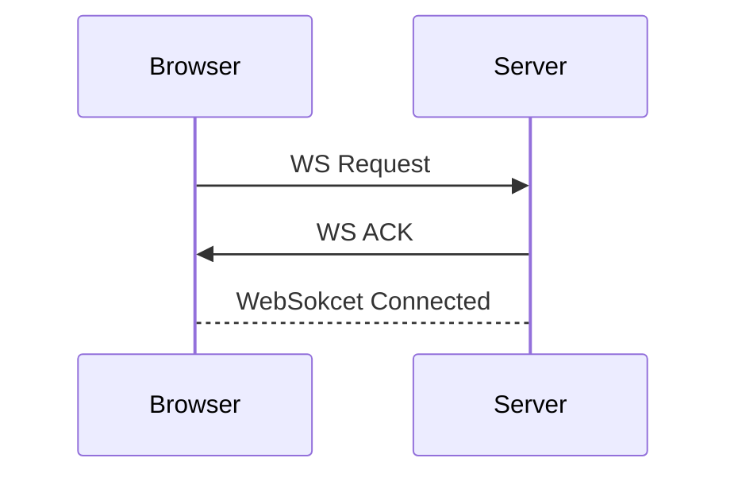

> Websocket 프로토콜 관련 내용 정리
# 1. WebSocket
기존 HTTP의 경우, Connectless 하기에 매 클라이언트 요청에 대한 응답을 반환하면 연결관계가 끊기게 된다. 허나 이는 스트리밍 서비스나 실시간 채팅 등의 서비스에서 큰 단점으로 부각되었으며, 이를 해결하기 위해 나온 프로토콜이 `WebSocket` 프로토콜이다
- *큰 맥락에서 Websocket 프로토콜은 [[http|HTTP]] / [[https|HTTPS]]프로토콜의 상위 호환이다.*

## 1-1. WebSocket 연결 과정

1. Browser에서 HTTP 요청을 보낸다.
	- WebSocket 프로토콜의 경우 WS 요청을 보냄
2. Server에서는 요청받은 HTTP 요청이 WS 인 경우 WebSocket 연결 응답을 보낸다.
3. 이 후 Browser와 Server는 WebSocket 프로토콜 기반 하에 연결이 유지된다.
# Ref
- https://sooolog.dev/HTTP-%ED%86%B5%EC%8B%A0%EA%B3%BC-TCP-%ED%86%B5%EC%8B%A0-%EA%B7%B8%EB%A6%AC%EA%B3%A0-%EC%9B%B9-%EC%86%8C%EC%BC%93%EC%97%90-%EB%8C%80%ED%95%9C-%EA%B8%B0%EB%B3%B8-%EA%B0%9C%EB%85%90-%EC%A0%95%EB%A6%AC/